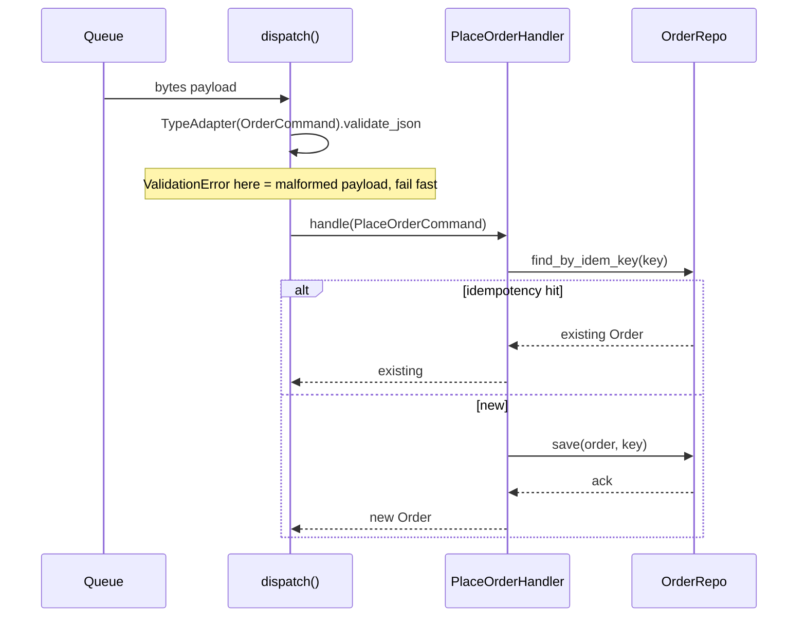

# Command

## Intent

Encapsulate a request as an object, thereby letting you parameterize clients
with different requests, queue or log requests, and support undoable operations.
Command turns "call a method" into "construct a value that represents calling a
method later."

## Use When

Use Command when at least one requirement is real: queueing work, recording what
happened for audit, supporting undo, supporting multiple invokers such as
CLI/HTTP/gRPC against the same action, or retrying with idempotency.

## Prefer A Simpler Python Shape When

Use a synchronous method call when the action does not need queuing, audit,
undo, retry, or multi-invoker support. `service.place_order(...)` is fine;
promote it to a Command only when one of those requirements becomes real.

## Structure

Boundary command: payload arrives, gets validated, dispatched, and persisted.



## Strict-Typed Python Sketch

Command has two genuinely different flavors. Pick by where the command
originates.

Boundary commands are Pydantic-primary because most real commands cross a trust
boundary: they arrive as JSON on a queue, an HTTP body, or a CLI argument set.
Pydantic v2 with `Annotated[T, Field(...)]` enforces invariants at parse time,
so the handler can trust its input.

```python
from dataclasses import dataclass
from pydantic import BaseModel, ConfigDict, Field, TypeAdapter
from typing import Annotated, Final, Literal, NewType, Protocol, assert_never
from uuid import UUID

UserId = NewType("UserId", str)
OrderId = NewType("OrderId", str)


class LineItem(BaseModel):
    model_config = ConfigDict(frozen=True, extra="forbid")

    sku: Annotated[str, Field(min_length=1, max_length=64)]
    quantity: Annotated[int, Field(gt=0, le=10_000)]
    price_cents: Annotated[int, Field(ge=0)]


class PlaceOrderCommand(BaseModel):
    model_config = ConfigDict(frozen=True, extra="forbid")

    type: Literal["place_order"] = "place_order"
    user_id: UserId
    items: Annotated[tuple[LineItem, ...], Field(min_length=1, max_length=200)]
    idempotency_key: UUID


class CancelOrderCommand(BaseModel):
    model_config = ConfigDict(frozen=True, extra="forbid")

    type: Literal["cancel_order"] = "cancel_order"
    order_id: OrderId
    idempotency_key: UUID


type OrderCommand = Annotated[
    PlaceOrderCommand | CancelOrderCommand,
    Field(discriminator="type"),
]


@dataclass(frozen=True, slots=True)
class Order:
    id: OrderId
    user_id: UserId
    items: tuple[LineItem, ...]


class CommandHandler[CommandT, ResultT](Protocol):
    def handle(self, command: CommandT) -> ResultT: ...


class PlaceOrderHandler:
    def __init__(self, repo: "OrderRepo") -> None:
        self._repo = repo

    def handle(self, command: PlaceOrderCommand) -> Order:
        existing = self._repo.find_by_idem_key(command.idempotency_key)
        if existing is not None:
            return existing
        order = Order(
            id=OrderId(_new_id()),
            user_id=command.user_id,
            items=command.items,
        )
        self._repo.save(order, idem_key=command.idempotency_key)
        return order


_ORDER_COMMAND: Final = TypeAdapter(OrderCommand)


def dispatch(
    payload: bytes,
    place: PlaceOrderHandler,
    cancel: "CancelOrderHandler",
) -> Order:
    command = _ORDER_COMMAND.validate_json(payload)
    match command:
        case PlaceOrderCommand():
            return place.handle(command)
        case CancelOrderCommand():
            return cancel.handle(command)
        case _:
            assert_never(command)
```

`_ORDER_COMMAND.validate_json(payload)` raises `pydantic.ValidationError` on a
malformed payload before a handler ever runs. The `match` is exhaustive because
the discriminated union is closed; adding `RefundOrderCommand` triggers a
checker error at `assert_never`.

For in-process undo commands, use frozen dataclasses. When the command never
crosses a boundary, the dataclass form is simpler and faster: no validator
overhead, no schema, no JSON round-trip.

```python
from dataclasses import dataclass
from typing import Protocol


class UndoableCommand[StateT](Protocol):
    def execute(self, state: StateT) -> StateT: ...
    def undo(self, state: StateT) -> StateT: ...


@dataclass(frozen=True, slots=True)
class InsertText:
    position: int
    text: str

    def execute(self, state: str) -> str:
        return state[: self.position] + self.text + state[self.position :]

    def undo(self, state: str) -> str:
        end = self.position + len(self.text)
        return state[: self.position] + state[end :]
```

Pick `BaseModel` when the command originates outside the process: queue, HTTP,
CLI, or file. Pick `@dataclass(frozen=True)` when the command is constructed and
consumed in-process: undo stack, in-memory replay, or GUI command queue. Mixing
is fine: `OrderCommand` may sit at the boundary while a `History[InsertText]`
undo stack lives entirely in-process.

## Type-Safety Notes

Pydantic-primary commands give you parse-time invariants:
`Annotated[int, Field(gt=0)]` is checked at `validate_json`, not at handler
entry. Use a `Literal` discriminator field plus `Field(discriminator=...)` so
`match` over the union is exhaustive and `assert_never` catches missing cases.
Keep `extra="forbid"` on every command model to reject unknown fields in
payloads. PEP 695 generic protocols (`CommandHandler[CommandT, ResultT]`) keep
handler-command pairs aligned; the `match`-over-discriminated-union form removes
the legacy `cast` that a `type[Command] -> Handler` registry would otherwise
need.

## Common Misuse

A "Command" class that is just function-call indirection, with no queuing,
audit, undo, retry, or multi-invoker requirement. That adds Command and Handler
classes where one function would do. Do not make in-process commands `BaseModel`
"for consistency"; you pay validator cost on every construction for invariants
already enforced upstream.

## Real-World Examples

- Celery tasks: each `@task` is a Command; the queue is the invoker.
- Click `Command` and `Group`: each subcommand is a callable Command
  parameterized by parsed arguments.
- `concurrent.futures.Executor.submit(fn, *args)`: the submitted call is a
  Command; the future is the result handle.

## References

- Gamma et al., _Design Patterns_ (1994), pp. 233-242.
- Refactoring Guru, [Command](https://refactoring.guru/design-patterns/command).
- Freeman and Robson, _Head First Design Patterns_, 2nd ed., ch. 6.
