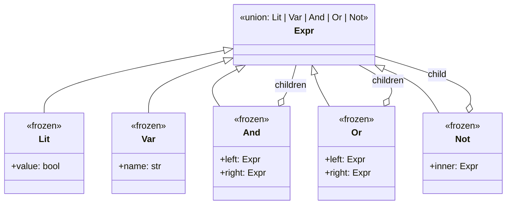

# Interpreter

## Intent

Given a language, define a representation for its grammar along with an
interpreter that uses the representation to interpret sentences. Build an
abstract syntax tree of the language, then walk it to evaluate, render,
transform, or analyze.

## Use When

Use Interpreter for a small DSL: a query filter, a price-rule expression, or a
feature-flag predicate. The grammar rules should be bounded: tens, not hundreds.

## Prefer A Simpler Python Shape When

For anything larger than a small DSL, use `lark`, `parsimonious`, or compile to
a real bytecode. Real parsers handle precedence, associativity, error recovery,
and Unicode better than a hand-rolled parser. Do not use Interpreter for general
control flow inside your app; embed a real language such as Starlark or Lua, or
accept that you should be writing functions.

## Structure

The AST is a discriminated union of frozen node types. Recursive nodes (`And`,
`Or`, `Not`) hold child `Expr` values.



## Strict-Typed Python Sketch

A discriminated union of node types plus a recursive evaluator is how Python's
own `ast` module is shaped, scaled down. The AST is the structural Composite;
the evaluator is the Visitor.

```python
from dataclasses import dataclass
from typing import assert_never


@dataclass(frozen=True, slots=True)
class Lit:
    value: bool


@dataclass(frozen=True, slots=True)
class Var:
    name: str


@dataclass(frozen=True, slots=True)
class And:
    left: "Expr"
    right: "Expr"


@dataclass(frozen=True, slots=True)
class Or:
    left: "Expr"
    right: "Expr"


@dataclass(frozen=True, slots=True)
class Not:
    inner: "Expr"


type Expr = Lit | Var | And | Or | Not


def evaluate(expr: Expr, env: dict[str, bool]) -> bool:
    match expr:
        case Lit(value=v):
            return v
        case Var(name=n):
            return env[n]
        case And(left=l, right=r):
            return evaluate(l, env) and evaluate(r, env)
        case Or(left=l, right=r):
            return evaluate(l, env) or evaluate(r, env)
        case Not(inner=i):
            return not evaluate(i, env)
        case _:
            assert_never(expr)


def render(expr: Expr) -> str:
    match expr:
        case Lit(value=v):
            return "true" if v else "false"
        case Var(name=n):
            return n
        case And(left=l, right=r):
            return f"({render(l)} AND {render(r)})"
        case Or(left=l, right=r):
            return f"({render(l)} OR {render(r)})"
        case Not(inner=i):
            return f"NOT {render(i)}"
        case _:
            assert_never(expr)


expr: Expr = And(Var("logged_in"), Or(Var("admin"), Not(Var("locked"))))
assert evaluate(expr, {"logged_in": True, "admin": False, "locked": False}) is True
```

Usually a parser produces the AST. The evaluator should not parse strings while
evaluating nodes; keep parsing, tree construction, and interpretation as
separate steps.

## Type-Safety Notes

Discriminated unions plus `assert_never` give exhaustiveness: adding a `Xor`
node triggers a type error at every dispatch site that did not add a case. This
is the main reason to favor union plus `match` over class-based Visitor in
Python: the checker tells you exactly which evaluators need updating. Keep AST
nodes frozen and slotted. They should be values, not stateful objects.

## Common Misuse

"We'll just write a small Python evaluator with `eval()`" is not Interpreter; it
is a remote-code-execution vulnerability. Define a real grammar, or use an
existing sandbox.

## Real-World Examples

- `ast` module: `ast.parse` returns a tree, `ast.NodeVisitor` walks it, and
  `ast.unparse` renders it.
- `re` module's compiled pattern: the regex AST is the language; matching is the
  interpreter.
- SQLAlchemy's expression language: `Column == value`, `and_(...)`, and
  `or_(...)` build a tree that the dialect-specific compiler interprets into
  SQL.

## References

- Gamma et al., _Design Patterns_ (1994), pp. 243-256.
- Refactoring Guru does not document Interpreter. It is the only GoF pattern
  omitted from their public 22-pattern catalog list.
- Brandon Rhodes, _python-patterns.guide_; Interpreter is flagged as rare in
  pure Python and usually subsumed by `match`.
