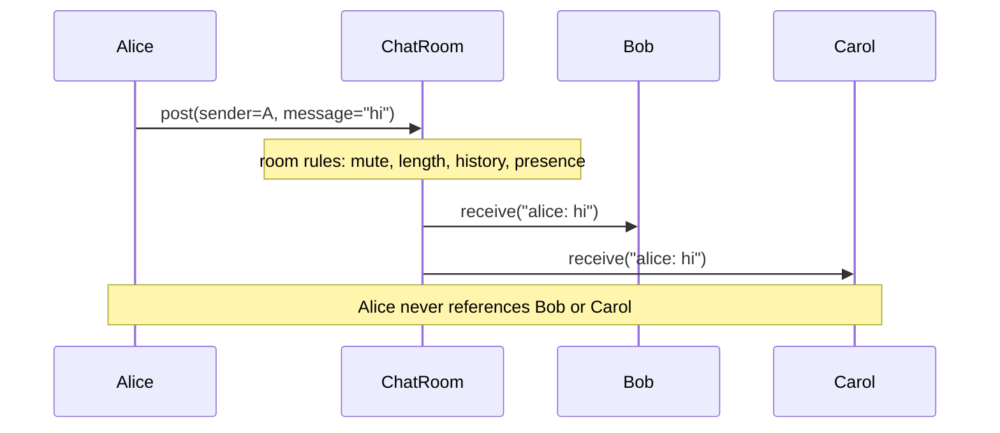

# Mediator

## Intent

Define an object that encapsulates how a set of objects interact. Mediator
promotes loose coupling by keeping objects from referring to each other
explicitly, and lets you vary their interaction independently. It is the
operations center participants talk to instead of talking to each other.

## Use When

- Several objects all need to know about events from each other, producing
  many-to-many coupling.
- You want to centralize coordination logic: what happens when X changes.
- Participants should stay focused on their own concerns.
- UI forms, chat rooms, air-traffic control systems, and actor networks.

## Prefer A Simpler Python Shape When

Use a direct relationship when there are only two participants. Many-to-many
coupling between two things is just one relationship; introduce a Mediator only
when the third participant appears. When the coordinator's logic exceeds a
screen of branching, split it into multiple coordinators or model the
coordinator itself as a state machine.

## Structure

One participant posts; the mediator applies its rules; the mediator fans the
filtered message out to every other participant. A participant never knows the
others by name.



## Strict-Typed Python Sketch

A chat room is the canonical Mediator. Users post to the room; the room decides
who hears what. Adding mute, rate-limiting, or message-length rules edits one
place; users stay focused on "say things, receive things."

```python
from dataclasses import dataclass, field
from typing import Final, Protocol


class ChatRoomMediator(Protocol):
    def post(self, *, sender: "User", message: str) -> None: ...
    def announce_join(self, user: "User") -> None: ...
    def announce_leave(self, user: "User") -> None: ...


@dataclass
class User:
    name: str
    room: ChatRoomMediator
    inbox: list[str] = field(default_factory=list)

    def say(self, message: str) -> None:
        self.room.post(sender=self, message=message)

    def receive(self, line: str) -> None:
        self.inbox.append(line)

    def join(self) -> None:
        self.room.announce_join(self)

    def leave(self) -> None:
        self.room.announce_leave(self)


class ChatRoom:
    def __init__(self, *, max_message_length: int = 280) -> None:
        self._members: list[User] = []
        self._muted: set[str] = set()
        self._max_len: Final[int] = max_message_length
        self._history: list[str] = []

    def post(self, *, sender: User, message: str) -> None:
        if sender.name in self._muted:
            return
        if len(message) > self._max_len:
            sender.receive(f"[system] message exceeds {self._max_len} chars")
            return
        line = f"{sender.name}: {message}"
        self._history.append(line)
        for member in self._members:
            if member is not sender:
                member.receive(line)

    def announce_join(self, user: User) -> None:
        self._members.append(user)
        for member in self._members:
            if member is not user:
                member.receive(f"[system] {user.name} joined")

    def announce_leave(self, user: User) -> None:
        self._members.remove(user)
        for member in self._members:
            member.receive(f"[system] {user.name} left")

    def mute(self, name: str) -> None:
        self._muted.add(name)
```

Observer is one-to-many notification with no coordination: the subject does not
know what observers do. Mediator is many-to-many coordination with centralized
logic: the mediator decides what happens. Observer is fan-out; Mediator is a
hub.

## Type-Safety Notes

Type participants against the `ChatRoomMediator` Protocol, not the concrete
`ChatRoom`. That keeps participants reusable across mediators: a `User` works
for a chat room, a moderated room, or a logged room. If you have a closed set of
event types coming from the mediator back to participants, promote them to a
discriminated union with `match` rather than ad-hoc method names; the checker
then enforces exhaustive handling on the participant side.

## Common Misuse

A "mediator" with one method per participant pair (`on_a_to_b`, `on_b_to_a`).
The mediator should encapsulate the interaction, not enumerate every pairwise
wiring. If it is enumerating pairs, you moved the many-to-many coupling inside
one class.

## Real-World Examples

- `tkinter` and Qt forms: the controller class is the mediator that knows about
  every widget.
- `asyncio` `EventLoop` mediates between coroutines, futures, and I/O sources.
- A chat room: each user posts to the room; the room delivers to others. No user
  references another user.

## References

- Gamma et al., _Design Patterns_ (1994), pp. 273-282.
- Refactoring Guru,
  [Mediator](https://refactoring.guru/design-patterns/mediator).
