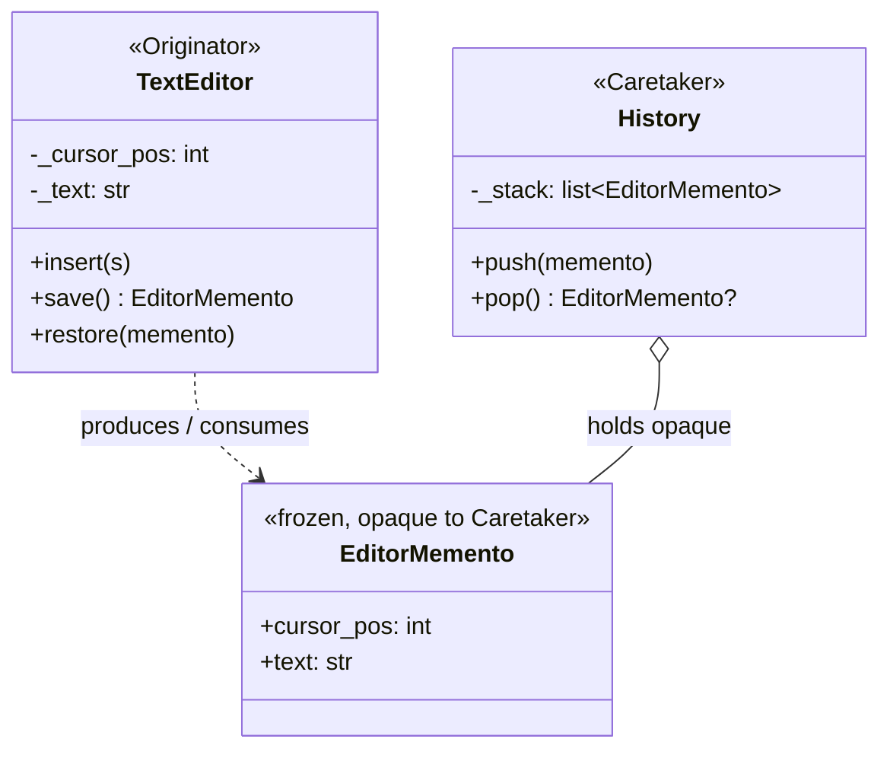

# Memento

## Intent

Without violating encapsulation, capture and externalize an object's internal state so the object can be restored to this state later. The object exposes a token, the memento, that callers can hold and hand back without ever seeing the internal representation.

## Use When

- Undo/redo: text editors, drawing apps.
- Snapshot a session and resume it: game saves, REPL state, debugger snapshots.
- Atomic operations: take a memento, attempt the change, restore on failure.

## Prefer A Simpler Python Shape When

Avoid Memento for mutable objects without genuine undo needs. A naive `deepcopy` for "just in case" is expensive and no safer. Build Memento only when the API needs to expose save/restore as a feature. If the state is huge, copying GBs per snapshot is a memory disaster; consider event sourcing or structural sharing.

## Structure

The caretaker holds opaque mementos but never reads them. Only the originator understands the internal shape.



## Strict-Typed Python Sketch

Use a frozen dataclass as the memento; the originator owns serialization.

```python
from dataclasses import dataclass


@dataclass(frozen=True, slots=True)
class EditorMemento:
    cursor_pos: int
    text: str


class TextEditor:
    def __init__(self) -> None:
        self._cursor_pos: int = 0
        self._text: str = ""

    def insert(self, s: str) -> None:
        self._text = self._text[: self._cursor_pos] + s + self._text[self._cursor_pos :]
        self._cursor_pos += len(s)

    def save(self) -> EditorMemento:
        return EditorMemento(cursor_pos=self._cursor_pos, text=self._text)

    def restore(self, memento: EditorMemento) -> None:
        self._cursor_pos = memento.cursor_pos
        self._text = memento.text


class History:
    def __init__(self) -> None:
        self._stack: list[EditorMemento] = []

    def push(self, memento: EditorMemento) -> None:
        self._stack.append(memento)

    def pop(self) -> EditorMemento | None:
        return self._stack.pop() if self._stack else None
```

For large states, frozen dataclasses with structural sharing make snapshots cheap. `replace` creates new states without copying unchanged fields.

When the memento must be persisted between runs, `BaseModel` gives you `model_dump_json` and `model_validate_json` without writing serializers, and validators check the shape on every restore.

```python
from datetime import UTC, datetime
from pathlib import Path
from pydantic import BaseModel, ConfigDict, Field
from typing import Annotated


class EditorSnapshot(BaseModel):
    model_config = ConfigDict(frozen=True, extra="forbid")

    cursor_pos: Annotated[int, Field(ge=0)]
    text: str
    saved_at: datetime


class PersistentTextEditor(TextEditor):
    def save_to_disk(self, path: Path) -> None:
        snap = EditorSnapshot(
            cursor_pos=self._cursor_pos,
            text=self._text,
            saved_at=datetime.now(UTC),
        )
        path.write_bytes(snap.model_dump_json().encode())

    def restore_from_disk(self, path: Path) -> None:
        snap = EditorSnapshot.model_validate_json(path.read_bytes())
        self.restore(EditorMemento(cursor_pos=snap.cursor_pos, text=snap.text))
```

For in-memory undo stacks where the memento never leaves the process, the frozen dataclass form is faster. Skip the validator round trip.

## Type-Safety Notes

The memento is a private type. Do not leak its fields to the caretaker. A `History` that calls `memento.text` directly has broken encapsulation; it should only hand the memento back to `restore`. PEP 695 generics (`History[MementoT]`) let you type the caretaker against any frozen-dataclass memento. If the memento contains mutable fields, you have a snapshot bug waiting to happen. Make it `frozen=True, slots=True` and copy mutable parts when constructing it: `tuple(items)` over a shared `list`.

## Common Misuse

A memento that exposes mutable references back to the originator's internal data. Calling `memento.inventory.append(...)` mutates the saved state and the present state if they share the same list. Freeze the memento and treat it as a value.

## Real-World Examples

- `pickle.dumps(obj) -> bytes` and `pickle.loads(bytes) -> obj` is Memento with serialization.
- `copy.deepcopy(state)` plus restore by assignment is the no-encapsulation form.
- Database transactions: `BEGIN` is save, `ROLLBACK` is restore, and `COMMIT` discards the memento.
- IPython `%store` magic captures a kernel-side variable for later sessions.

## References

- Gamma et al., *Design Patterns* (1994), pp. 283-292.
- Refactoring Guru, [Memento](https://refactoring.guru/design-patterns/memento).
