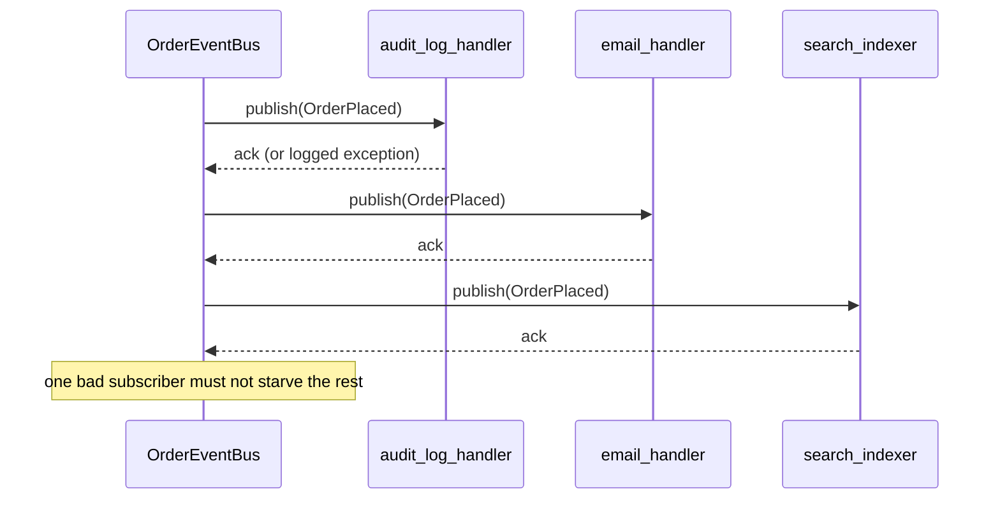

# Observer

## Intent

Define a one-to-many dependency between objects so when one changes state, all its dependents are notified and updated automatically. Subjects publish events; observers subscribe; neither knows the other's identity.

## Use When

Use Observer for decoupled fan-out: a domain event happens and multiple subsystems react, such as audit log, email, and search indexer, but the publisher does not know who is listening. It also fits UI binding and distributed event buses; Kafka topics are Observer at scale.

## Prefer A Simpler Python Shape When

Use a direct method call or Command when the caller needs the result. Observers are fire-and-forget. Do not use Observer to "decouple" something that is intrinsically a synchronous request/response.

## Structure

One publish, N deliveries; the publisher does not know who is listening.



## Strict-Typed Python Sketch

A typed in-process event bus. Parameterize per event type; do not build a god-bus that passes untyped payloads.

```python
import logging
from collections.abc import Callable
from dataclasses import dataclass
from typing import NewType

logger = logging.getLogger(__name__)

OrderId = NewType("OrderId", str)


@dataclass(frozen=True, slots=True)
class OrderPlaced:
    order_id: OrderId
    total_cents: int


type OrderPlacedHandler = Callable[[OrderPlaced], None]


class OrderEventBus:
    def __init__(self) -> None:
        self._handlers: list[OrderPlacedHandler] = []

    def subscribe(self, handler: OrderPlacedHandler) -> None:
        self._handlers.append(handler)

    def publish(self, event: OrderPlaced) -> None:
        for handler in self._handlers:
            try:
                handler(event)
            except Exception:
                logger.exception(
                    "observer failed",
                    extra={"event": event, "handler": repr(handler)},
                )
```

Observer pitfalls:

- Exceptions in one observer must not starve the others. Catch and log; re-raising in the subject means one bad subscriber breaks publishing for everyone.
- Registration leaks. A long-lived bus holding strong references to short-lived observers prevents garbage collection. Use `weakref.WeakSet` or `WeakMethod` when lifetimes differ.
- Order dependence is a smell. If observer B requires observer A to have run first, you have hidden coupling. Make it explicit with a pipeline or a single composed handler.
- Synchronous observers in performance paths. If `publish` is on the hot path and one observer takes 200 ms, every caller pays. Push to a queue.

When events leave the process, `BaseModel` events give every consumer parse-time schema validation, so a poison-pill payload fails the parse, not the handler.

```python
from datetime import datetime
from pydantic import BaseModel, ConfigDict, Field, TypeAdapter
from typing import Annotated, Final, Literal


class OrderPlacedEvent(BaseModel):
    model_config = ConfigDict(frozen=True, extra="forbid")

    type: Literal["order.placed"] = "order.placed"
    order_id: OrderId
    total_cents: Annotated[int, Field(ge=0)]
    occurred_at: datetime


_EVENT: Final = TypeAdapter(OrderPlacedEvent)


def handle_message(raw: bytes) -> None:
    event = _EVENT.validate_json(raw)
    handle_order_placed(event)
```

For a pure in-process bus, the frozen-dataclass form is faster and avoids the validator round trip on every publish. Cross-process buses get Pydantic; in-process buses get dataclasses.

## Type-Safety Notes

Parameterize the bus by event type: one bus per event, or generic `EventBus[EventT]`. A mega-bus typed against `object` gives up useful checking at the subscribers. PEP 695 makes this clean: `class EventBus[EventT]: def publish(self, event: EventT) -> None: ...`. For a single bus over a closed event union, use a discriminated union such as `OrderPlaced | PaymentReceived` and dispatch with `match` inside subscribers.

## Common Misuse

"We made everything an event so we could decouple." Now nobody knows what happens when an order is placed; tracing requires running the program. Observer is not free decoupling. Every subscriber adds opacity to the call graph.

## Real-World Examples

- `tkinter.Variable.trace_add` registers a callback fired on variable change.
- Django signals (`post_save`, `pre_delete`) are Observer at the framework level.
- `redis.pubsub` and Kafka topics are Observer scaled across processes or hosts.
- `asyncio.Event` is the simplest one-shot Observer; `wait()` is the subscription.

## References

- Gamma et al., *Design Patterns* (1994), pp. 293-304.
- Refactoring Guru, [Observer](https://refactoring.guru/design-patterns/observer).
- Freeman and Robson, *Head First Design Patterns*, 2nd ed., ch. 2.
