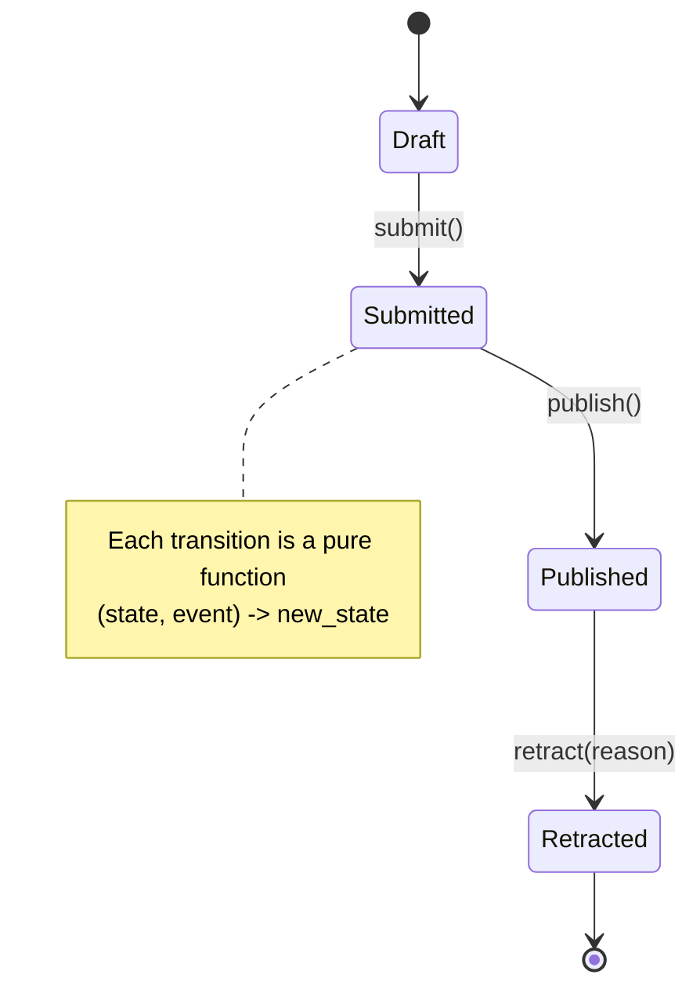

# State

## Intent

Allow an object to alter its behavior when its internal state changes. The object will appear to change its class. Each state is a distinct type; behavior dispatches by type rather than by checking a `status` string in every method.

## Use When

Use State for an object whose methods check `self.status == "X"` in most lines. The status string is the discriminator; the real shape is a state machine. State legalizes that shape.

## Prefer A Simpler Python Shape When

Use a boolean or `StrEnum` for trivial state such as `active: bool`. Reach for State when the available methods or legal transitions differ across states. When methods are the same and only data differs, you have an enum, not a state machine.

## Structure

The legal transitions are explicit; everything else raises `InvalidTransition`.



## Strict-Typed Python Sketch

Discriminated union via `match` is Python's canonical State pattern. Each state is a frozen dataclass; transitions are pure functions on `(state, event) -> new_state`.

```python
from dataclasses import dataclass
from datetime import UTC, datetime
from typing import assert_never


@dataclass(frozen=True, slots=True)
class Draft:
    content: str


@dataclass(frozen=True, slots=True)
class Submitted:
    content: str
    submitted_at: datetime


@dataclass(frozen=True, slots=True)
class Published:
    content: str
    published_at: datetime


@dataclass(frozen=True, slots=True)
class Retracted:
    content: str
    reason: str


type ArticleState = Draft | Submitted | Published | Retracted


class InvalidTransition(Exception): ...


def submit(state: ArticleState) -> ArticleState:
    match state:
        case Draft(content=c):
            return Submitted(content=c, submitted_at=datetime.now(UTC))
        case Submitted() | Published() | Retracted():
            raise InvalidTransition(f"cannot submit from {type(state).__name__}")
        case _:
            assert_never(state)


def publish(state: ArticleState) -> ArticleState:
    match state:
        case Submitted(content=c):
            return Published(content=c, published_at=datetime.now(UTC))
        case Draft() | Published() | Retracted():
            raise InvalidTransition(f"cannot publish from {type(state).__name__}")
        case _:
            assert_never(state)
```

Rust contrast: sum types beat polymorphism here because the compiler catches exhaustiveness.

```rust
enum ArticleState {
    Draft { content: String },
    Submitted { content: String, submitted_at: DateTime<Utc> },
    Published { content: String, published_at: DateTime<Utc> },
    Retracted { content: String, reason: String },
}

fn submit(state: ArticleState) -> Result<ArticleState, &'static str> {
    match state {
        ArticleState::Draft { content } => Ok(ArticleState::Submitted {
            content,
            submitted_at: Utc::now(),
        }),
        ArticleState::Submitted { .. } => Err("already submitted"),
        ArticleState::Published { .. } => Err("already published"),
        ArticleState::Retracted { .. } => Err("retracted"),
    }
}
```

Python's union plus `match` plus `assert_never` reaches the same outcome at type-check time, but only if you run `mypy --strict` or `pyright` and treat missing cases as errors.

## Type-Safety Notes

`assert_never` plus exhaustive `match` gives compile-time exhaustiveness. Stringly typed `status: str` does not, and it is the source of many production bugs in state-heavy codebases. Make every transition a function returning a new state. Treating states as immutable values eliminates "how did the object end up in two states at once" bugs.

When the set of states is closed and the operations vary across states, sum types beat polymorphism. Polymorphism shines when the operations are fixed and new variants keep arriving. For a state machine, you usually want every dispatch site forced to update when a new state appears.

## Common Misuse

A `status: str` field with thirty `if status == "X"` checks scattered through the class. That is a state machine pretending not to be one. Refactor by replacing the string with a discriminated union and the if-chains with `match`.

## Real-World Examples

- `asyncio.Future` states (`PENDING`, `CANCELLED`, `FINISHED`): the methods you can call legally depend on the state.
- HTTP request lifecycle: `PENDING -> SENT -> RESPONSE_RECEIVED -> CLOSED`.
- TCP socket states (`LISTEN`, `SYN-SENT`, `ESTABLISHED`, `FIN-WAIT-1`, ...): the canonical state-machine example.

## References

- Gamma et al., *Design Patterns* (1994), pp. 305-314.
- Refactoring Guru, [State](https://refactoring.guru/design-patterns/state).
- Brandon Rhodes, *python-patterns.guide*, "State."
