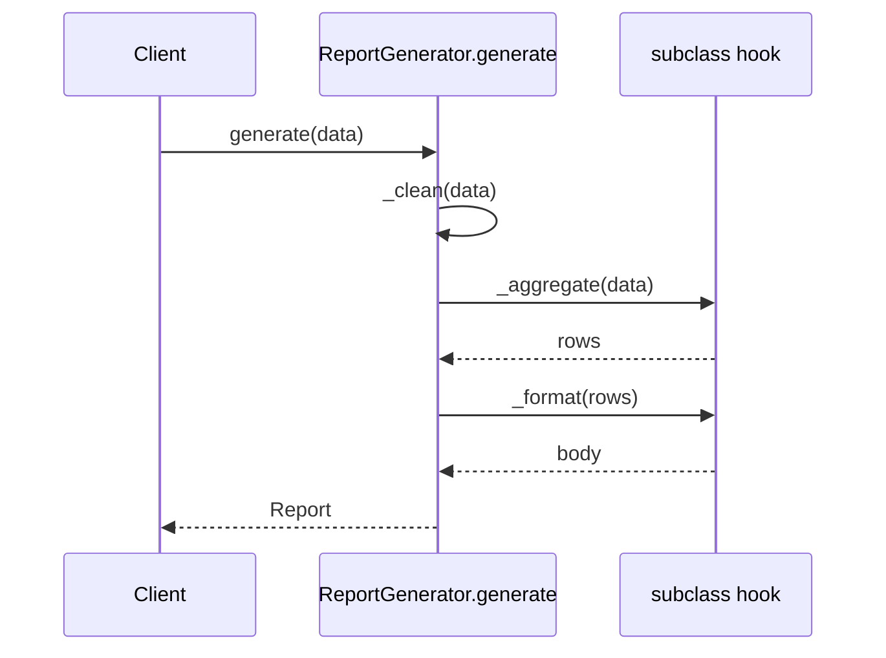

# Template Method

## Intent

Define the skeleton of an algorithm in an operation, deferring some steps to subclasses. Template Method lets subclasses redefine certain steps without changing the algorithm's structure.

## Use When

Use Template Method when several variants share the same workflow but differ in a few well-defined steps. In modern Python, prefer the composition form unless an external framework or inherited contract forces the inheritance shape.

## Prefer A Simpler Python Shape When

Prefer injection/composition for pipelines. A frozen dataclass of callables lets you mix `weekly_aggregate` with `markdown_format` without writing a subclass for every combination. Use Strategy for each varying step when subclassing starts producing `WeeklyMarkdownReport`, `WeeklyCsvReport`, `MonthlyMarkdownReport`, and `MonthlyCsvReport`.

## Structure

The base class owns the skeleton; the subclass fills in the abstract steps. The order of calls is fixed by the base.



## Strict-Typed Python Sketch

Inheritance form, for when the framework demands it:

```python
from abc import ABC, abstractmethod
from dataclasses import dataclass
from typing import override


@dataclass(frozen=True, slots=True)
class ReportData:
    rows: list[dict[str, object]]


@dataclass(frozen=True, slots=True)
class Row:
    label: str
    value: float


@dataclass(frozen=True, slots=True)
class Report:
    body: str


class ReportGenerator(ABC):
    def generate(self, data: ReportData) -> Report:
        return Report(body=self._format(self._aggregate(self._clean(data))))

    def _clean(self, data: ReportData) -> ReportData:
        return data

    @abstractmethod
    def _aggregate(self, data: ReportData) -> list[Row]: ...

    @abstractmethod
    def _format(self, rows: list[Row]) -> str: ...


class WeeklyCsvReport(ReportGenerator):
    @override
    def _aggregate(self, data: ReportData) -> list[Row]:
        weekly: dict[str, float] = {}
        for row in data.rows:
            week = str(row.get("week", ""))
            weekly[week] = weekly.get(week, 0.0) + float(row.get("value", 0))
        return [Row(label=week, value=value) for week, value in weekly.items()]

    @override
    def _format(self, rows: list[Row]) -> str:
        return "\n".join(f"{row.label},{row.value:.2f}" for row in rows)
```

The composition form often reads better in Python:

```python
from collections.abc import Callable


@dataclass(frozen=True, slots=True)
class ReportPipeline:
    clean: Callable[[ReportData], ReportData]
    aggregate: Callable[[ReportData], list[Row]]
    format: Callable[[list[Row]], str]

    def run(self, data: ReportData) -> Report:
        return Report(body=self.format(self.aggregate(self.clean(data))))
```

## Type-Safety Notes

`@override` catches misspelled hook methods at type-check time. Strict mypy or pyright can require it. Make abstract hooks return concrete domain types, not `object` or untyped values; the entire point of Template Method is that the skeleton is typed and only the steps vary in known ways.

## Common Misuse

A base class with twenty hooks, half of which are `raise NotImplementedError` defaults. Subclasses override only three; the rest are silent landmines. Either make hooks `@abstractmethod` or remove the unused ones. Avoid Template Method when subclasses need to override the skeleton itself; that is regular subclassing.

## Real-World Examples

- `unittest.TestCase`: `setUp`, `tearDown`, and `runTest` are Template Method hooks; the runner owns the skeleton.
- `json.JSONEncoder.default(o)`: the encoder owns the serialization workflow; subclasses override `default` to handle custom types.
- `http.server.BaseHTTPRequestHandler.handle()` calls `do_GET`, `do_POST`, and related hooks by HTTP method.

## References

- Gamma et al., *Design Patterns* (1994), pp. 325-330.
- Refactoring Guru, [Template Method](https://refactoring.guru/design-patterns/template-method).
- Freeman and Robson, *Head First Design Patterns*, 2nd ed., ch. 8.
