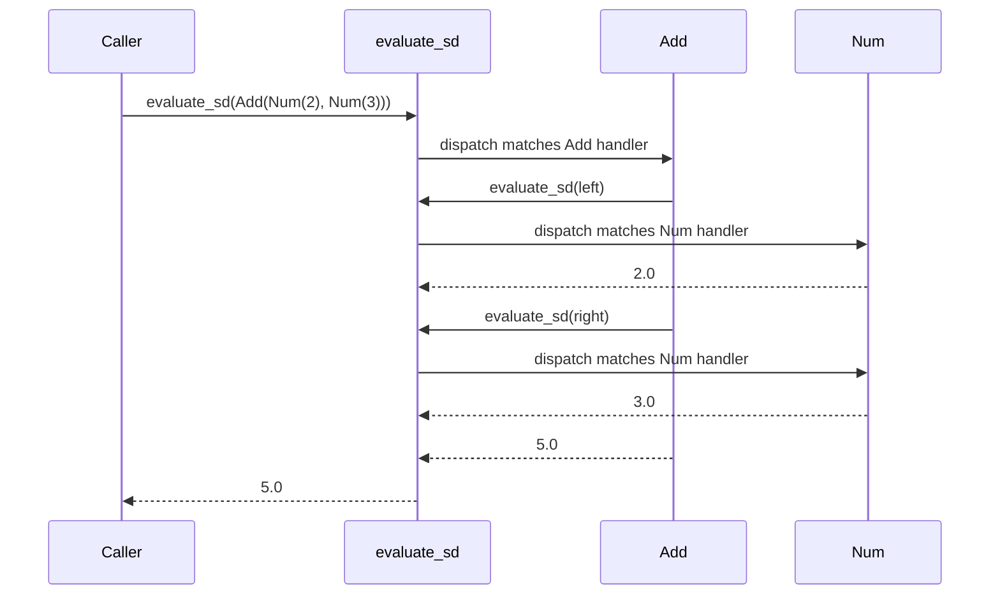

# Visitor

## Intent

Represent an operation to be performed on the elements of an object structure.
Visitor lets you define a new operation without changing the classes of the
elements on which it operates. The classic use is many operations over a fixed
AST.

## Use When

Use Visitor for a fixed type hierarchy such as an AST or tile system, over which
many operations need to be defined: evaluate, render, type-check, optimize,
lint. Adding new operations should not require touching the data classes.

## Prefer A Simpler Python Shape When

If the operation naturally belongs on the data class, use a method. Visitor
earns its place by separating the operation from the data. If both the type
hierarchy and operations vary, Visitor buys little; every new node forces every
visitor to update, and every new operation forces every node-handler matrix to
grow.

## Structure

Single-dispatch by node type; recursion drives traversal of children. The
`evaluate_sd` dispatcher picks the right registered handler per node.



## Strict-Typed Python Sketch

Python has two native shapes for the Visitor problem: `match` for closed,
exhaustive dispatch, and `functools.singledispatch` for open, distributed
dispatch.

`match` form: explicit, local, no dispatch plumbing.

```python
from dataclasses import dataclass
from typing import assert_never


@dataclass(frozen=True, slots=True)
class Num:
    value: float


@dataclass(frozen=True, slots=True)
class Add:
    left: "Expr"
    right: "Expr"


@dataclass(frozen=True, slots=True)
class Mul:
    left: "Expr"
    right: "Expr"


type Expr = Num | Add | Mul


def evaluate(expr: Expr) -> float:
    match expr:
        case Num(value=v):
            return v
        case Add(left=l, right=r):
            return evaluate(l) + evaluate(r)
        case Mul(left=l, right=r):
            return evaluate(l) * evaluate(r)
        case _:
            assert_never(expr)


def render(expr: Expr) -> str:
    match expr:
        case Num(value=v):
            return str(v)
        case Add(left=l, right=r):
            return f"({render(l)} + {render(r)})"
        case Mul(left=l, right=r):
            return f"({render(l)} * {render(r)})"
        case _:
            assert_never(expr)
```

`functools.singledispatch`: open dispatch; new operations register without
touching the dispatcher site.

```python
from functools import singledispatch


@singledispatch
def evaluate_sd(expr: object) -> float:
    raise TypeError(f"unsupported expression: {type(expr).__name__}")


@evaluate_sd.register
def _(expr: Num) -> float:
    return expr.value


@evaluate_sd.register
def _(expr: Add) -> float:
    return evaluate_sd(expr.left) + evaluate_sd(expr.right)


@evaluate_sd.register
def _(expr: Mul) -> float:
    return evaluate_sd(expr.left) * evaluate_sd(expr.right)
```

## Type-Safety Notes

- `match` with a discriminated union plus `assert_never` gives exhaustiveness:
  adding `Sub` to `Expr` triggers a type error at every dispatch site. This is
  the most important property of Python's Visitor implementation; if you need
  it, use `match`.
- `singledispatch` does not give exhaustiveness. A missing registration is a
  runtime `TypeError`. Test it explicitly, or accept the trade-off in exchange
  for cross-file extensibility.
- A class-based Visitor Protocol with one `visit_*` method per node gives
  exhaustiveness via "must implement every method," at the cost of a parallel
  hierarchy. That can be reasonable when there are many operations and you want
  the IDE to tell you when one is missing.

## Common Misuse

A "Visitor" that is just a `match` statement inside one method of the data
class. That is regular polymorphism, not Visitor. The pattern's value is
separating the operation from the data; if the operation lives on the data, use
a normal method.

## Real-World Examples

- `ast.NodeVisitor` and `ast.NodeTransformer`: the canonical visitor over
  Python's AST.
- `pickle.Pickler.dispatch` is a single-dispatch visitor over Python types.
- `mypy` and `pyright` both implement Visitor or a `match`-based equivalent over
  the AST for type inference.
- `pygments` lexers walk a token stream with a visitor-shaped formatter.

## References

- Gamma et al., _Design Patterns_ (1994), pp. 331-344.
- Refactoring Guru, [Visitor](https://refactoring.guru/design-patterns/visitor).
- Brandon Rhodes, _python-patterns.guide_; Visitor is largely subsumed by
  `functools.singledispatch` and `match`.
