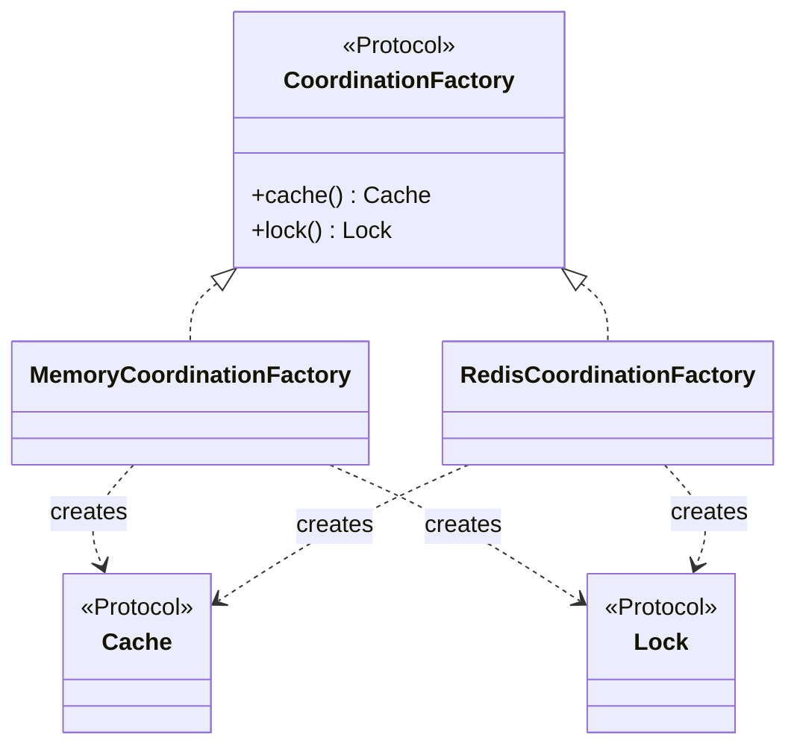

# Abstract Factory

## Intent

Provide an interface for creating families of related or dependent objects without specifying
their concrete classes. Swapping the factory swaps every product in one move and prevents
accidental mixing across families.

## Use When

- At least two coordinated backends have multiple products each, such as `Connection` plus
  `Cursor` for SQLite versus Postgres, or `Renderer` plus `Window` for SVG versus Canvas.
- Mixing products across families is a bug you want the type checker to catch.
- Selection happens once at the composition root; the rest of the program depends only on the
  abstract products.

## Prefer A Simpler Python Shape When

GoF Abstract Factory is "an interface that produces a family of products." In Python, that is
usually a `Protocol` whose methods return other `Protocol` types. If there is only one product,
or only one plausible backend, do not create a factory hierarchy. Inline construction at the
composition root and extract the abstraction when a second coordinated family appears.

Use a simple top-level selector when the choice is just configuration:

```python
def coordination_factory(backend: str, dsn: str | None = None) -> CoordinationFactory:
    match backend:
        case "memory":
            return MemoryCoordinationFactory()
        case "redis":
            if dsn is None:
                raise ValueError("redis backend requires dsn")
            return RedisCoordinationFactory(dsn)
        case _:
            raise ValueError(f"unknown backend: {backend}")
```

## Structure



## Strict-Typed Python Sketch

Two products, `Cache` and `Lock`, are coordinated across in-memory and Redis backends. Concrete
products stay private; only protocols leak.

```python
from dataclasses import dataclass, field
from typing import Protocol


class Cache(Protocol):
    def get(self, key: str) -> bytes | None: ...
    def set(self, key: str, value: bytes, ttl_s: float) -> None: ...


class Lock(Protocol):
    def acquire(self, key: str, ttl_s: float) -> bool: ...
    def release(self, key: str) -> None: ...


class CoordinationFactory(Protocol):
    def cache(self) -> Cache: ...
    def lock(self) -> Lock: ...


@dataclass(slots=True)
class _MemoryCache:
    _values: dict[str, bytes] = field(default_factory=dict)

    def get(self, key: str) -> bytes | None:
        return self._values.get(key)

    def set(self, key: str, value: bytes, ttl_s: float) -> None:
        self._values[key] = value


@dataclass(slots=True)
class _MemoryLock:
    _held: set[str] = field(default_factory=set)

    def acquire(self, key: str, ttl_s: float) -> bool:
        if key in self._held:
            return False
        self._held.add(key)
        return True

    def release(self, key: str) -> None:
        self._held.discard(key)


class MemoryCoordinationFactory:
    def cache(self) -> Cache:
        return _MemoryCache()

    def lock(self) -> Lock:
        return _MemoryLock()


class RedisCoordinationFactory:
    def __init__(self, dsn: str) -> None:
        self._dsn = dsn

    def cache(self) -> Cache:
        from .redis_adapters import RedisCache

        return RedisCache(self._dsn)

    def lock(self) -> Lock:
        from .redis_adapters import RedisLock

        return RedisLock(self._dsn)
```

## Type-Safety Notes

Concrete classes are private, such as `_MemoryCache`; only protocols leak. The factory's
return-type annotations bind concretes to protocols structurally, so the checker rejects
implementations whose method shapes drift. Generics rarely help. If you find yourself wanting
`CoordinationFactory[T]`, you probably have a Strategy hierarchy, not an Abstract Factory.

Family coordination is enforced at the module boundary: keep concrete products private to their
adapters so a caller cannot casually pair a Redis lock with an in-memory cache unless the public
factory explicitly allows that family.

## Common Misuse

A single-implementation Abstract Factory is two extra layers of indirection producing nothing
the constructor does not. Another common failure is a factory protocol with one concrete and a
TODO promising a second backend "soon." The abstraction calcifies; the second backend never
arrives; the codebase pays the indirection cost forever.

## Real-World Examples

- `sqlalchemy.engine.Engine` plus `Dialect` form a coordinated family: connection, cursor, and
  type compiler change together when the dialect changes.
- `multiprocessing.get_context("spawn" | "fork" | "forkserver")` is an abstract factory for
  `Process`, `Queue`, `Lock`, and `Event` with consistent start-method semantics.
- `logging` configuration commonly builds coordinated `Handler`, `Formatter`, and `Filter`
  families at the composition root.

## References

- Gamma et al., *Design Patterns* (1994), pp. 87-96.
- Refactoring Guru, [Abstract Factory](https://refactoring.guru/design-patterns/abstract-factory).
- Brandon Rhodes, [The Factory Method Pattern](https://python-patterns.guide/gang-of-four/factory-method/),
  for the Pythonic pressure toward factories as functions and protocols.
