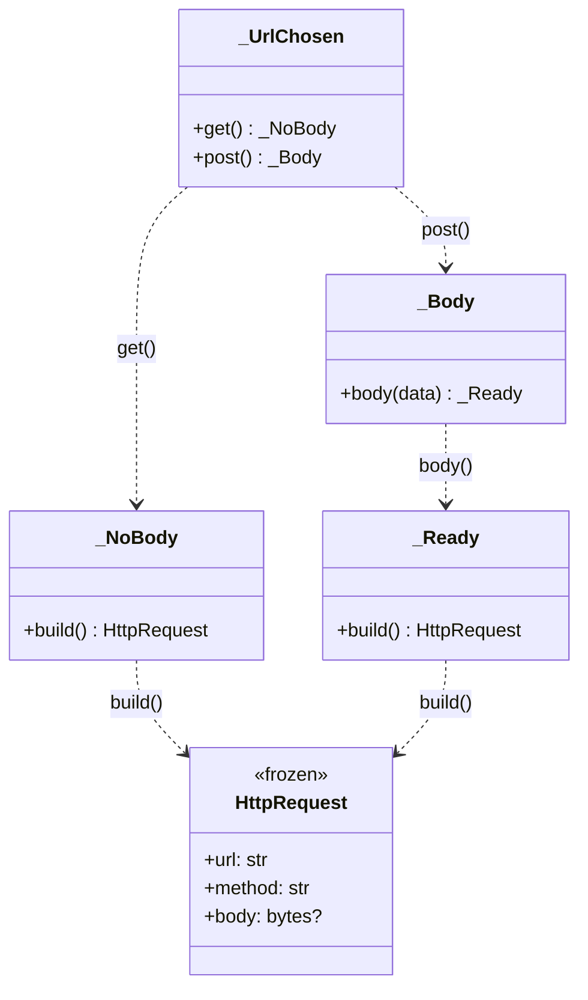

# Builder

## Intent

Separate the construction of a complex object from its representation, so the same process can
produce different representations or enforce step ordering through the type system.

## Use When

- An object takes many optional fields, and most call sites use only a small subset.
- Fields have temporal coupling: some must be set before others, and you want the checker to
  enforce that ordering.
- Partial-state objects should be unrepresentable. A half-built `Request` should not type-check
  as a complete one.

## Prefer A Simpler Python Shape When

A frozen dataclass with keyword-only fields handles most "complex object construction" in
Python. If the object has many optional fields but no temporal ordering constraint, use the
dataclass directly:

```python
from dataclasses import dataclass, field


@dataclass(frozen=True, slots=True, kw_only=True)
class HttpRequest:
    url: str
    method: str = "GET"
    headers: dict[str, str] = field(default_factory=dict)
    timeout_s: float = 5.0
    retries: int = 0
    body: bytes | None = None
```

When the request comes from JSON config or an API payload, use a validation model and cross-field
validation. You trade compile-time temporal ordering for runtime parse-time validation, which is
usually the right trade at a deserialization boundary.

```python
from typing import Annotated, Literal, Self

from pydantic import BaseModel, ConfigDict, Field, model_validator


class HttpRequestSpec(BaseModel):
    model_config = ConfigDict(frozen=True, extra="forbid")

    url: Annotated[str, Field(min_length=1)]
    method: Literal["GET", "POST", "PUT", "DELETE"] = "GET"
    body: bytes | None = None

    @model_validator(mode="after")
    def _post_requires_body(self) -> Self:
        if self.method == "POST" and self.body is None:
            raise ValueError("POST request requires a non-empty body")
        return self
```

## Structure

Phase progression: each method returns the next phase type, so out-of-order calls do not
type-check.



## Strict-Typed Python Sketch

When ordering must be enforced, such as "body only after a POST method is chosen," use a fluent
builder where each step returns the next type. Out-of-order calls become type errors.

```python
from dataclasses import dataclass, field


@dataclass(frozen=True, slots=True, kw_only=True)
class HttpRequest:
    url: str
    method: str = "GET"
    headers: dict[str, str] = field(default_factory=dict)
    timeout_s: float = 5.0
    retries: int = 0
    body: bytes | None = None


@dataclass(frozen=True, slots=True)
class _UrlChosen:
    url: str

    def get(self) -> "_NoBody":
        return _NoBody(url=self.url, method="GET")

    def post(self) -> "_Body":
        return _Body(url=self.url, method="POST")


@dataclass(frozen=True, slots=True)
class _NoBody:
    url: str
    method: str

    def build(self) -> HttpRequest:
        return HttpRequest(url=self.url, method=self.method)


@dataclass(frozen=True, slots=True)
class _Body:
    url: str
    method: str

    def body(self, data: bytes) -> "_Ready":
        return _Ready(url=self.url, method=self.method, body=data)


@dataclass(frozen=True, slots=True)
class _Ready:
    url: str
    method: str
    body: bytes

    def build(self) -> HttpRequest:
        return HttpRequest(url=self.url, method=self.method, body=self.body)


def request(url: str) -> _UrlChosen:
    return _UrlChosen(url=url)


# Legal:   request("x").post().body(b"{}").build()
# Illegal: request("x").build()         - _UrlChosen has no .build
# Illegal: request("x").get().body(b"") - _NoBody has no .body
```

## Type-Safety Notes

Builder phases are types, not flags. Each phase exposes only the methods legal in that phase;
the checker rejects illegal call sequences at compile time. Keep phase classes private; only the
entry function, such as `request`, and the final immutable result, such as `HttpRequest`, are
public. Avoid generics here: phase progression is structural, and parametrization clutters
signatures.

## Common Misuse

A typed builder for a simple value object with three fields is unnecessary. Reserve typed
builders for genuine temporal-coupling invariants.

The most common anti-pattern is a "builder" with thirty `set_*` methods returning `self`, every
method taking optional arguments, and a `build` method validating required fields at runtime.
That reinvents the dataclass while losing the type checker's help.

## Real-World Examples

- `sqlalchemy.select()` returns a query builder where methods such as `where`, `order_by`, and
  `limit` return refined query objects.
- `pathlib.Path` builds paths through `/` chaining; each step returns a new immutable `Path`.
- `polars.DataFrame.lazy()` returns a `LazyFrame`; each transform builds a plan step by step
  before `collect()` materializes the result.

## References

- Gamma et al., *Design Patterns* (1994), pp. 97-106.
- Refactoring Guru, [Builder](https://refactoring.guru/design-patterns/builder).
- Freeman and Robson, *Head First Design Patterns* (2nd ed., 2020), ch. 14.
