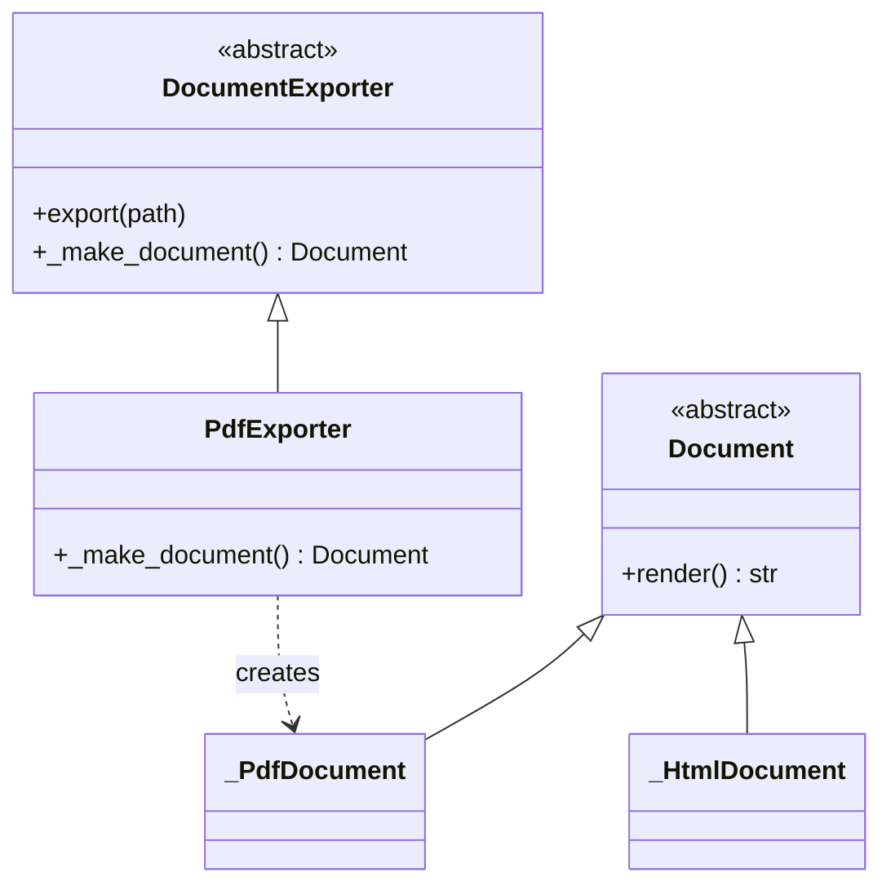

# Factory Method

## Intent

Define an interface for creating an object, but let subclasses or a registered
factory function decide which class to instantiate. The pattern lets a class
defer instantiation without exposing the conditional itself.

## Use When

A caller knows it wants "a parser" or "a document" but not which concrete parser
or document. The decision depends on configuration, input shape, or a framework
hook.

In Python, the inheritance shape is rarely the right default. Reach for the
class-hook form only when an external framework demands the
Template-Method-style hook. Otherwise, a top-level function or registry is
clearer.

## Prefer A Simpler Python Shape When

Factory Method exists because Smalltalk needs the receiver of `new` to be a
class, and the only way to swap classes was subclassing. Python lets a function
return any class, so the factory can usually be just a function:

```python
from collections.abc import Callable
from typing import Protocol


class Parser(Protocol):
    def parse(self, text: str) -> dict[str, object]: ...


class JsonParser:
    def parse(self, text: str) -> dict[str, object]:
        return {"format": "json", "text": text}


class YamlParser:
    def parse(self, text: str) -> dict[str, object]:
        return {"format": "yaml", "text": text}


def parser_for(content_type: str) -> Parser:
    match content_type:
        case "application/json":
            return JsonParser()
        case "application/yaml" | "application/x-yaml":
            return YamlParser()
        case _:
            raise ValueError(f"unsupported content type: {content_type}")


_PARSERS: dict[str, Callable[[], Parser]] = {
    "application/json": JsonParser,
    "application/yaml": YamlParser,
}


def parser_for_dynamic(content_type: str) -> Parser:
    factory = _PARSERS.get(content_type)
    if factory is None:
        raise ValueError(f"unsupported content type: {content_type}")
    return factory()
```

The `match` form keeps dispatch local and obvious; the registry trades
exhaustiveness for runtime extensibility.

For plugin or parser registries that dispatch over Pydantic models, prefer a
discriminated union. Pydantic v2 does the dispatch via
`Field(discriminator=...)`; no manual `dict[str, type[BaseModel]]` registry is
needed.

```python
from typing import Annotated, Final, Literal

from pydantic import BaseModel, Field, TypeAdapter


class JsonConfig(BaseModel):
    type: Literal["json"] = "json"
    indent: Annotated[int, Field(ge=0, le=10)] = 2


class YamlConfig(BaseModel):
    type: Literal["yaml"] = "yaml"
    flow_style: bool = False


type ParserConfig = Annotated[
    JsonConfig | YamlConfig,
    Field(discriminator="type"),
]


_PARSER_CONFIG: Final[TypeAdapter[ParserConfig]] = TypeAdapter(ParserConfig)


def parse_config(raw: bytes) -> ParserConfig:
    return _PARSER_CONFIG.validate_json(raw)
```

## Structure



## Strict-Typed Python Sketch

This is the inheritance shape for a framework-imposed hook: subclasses provide
the concrete document while the base class owns the export algorithm.

```python
from abc import ABC, abstractmethod
from typing import override


class Document(ABC):
    @abstractmethod
    def render(self) -> str: ...


class _PdfDocument(Document):
    @override
    def render(self) -> str:
        return "%PDF-1.7\n..."


class _HtmlDocument(Document):
    @override
    def render(self) -> str:
        return "<html>...</html>"


class DocumentExporter(ABC):
    """Framework-imposed shape: subclasses provide the concrete document."""

    def export(self, path: str) -> None:
        document = self._make_document()
        with open(path, "w", encoding="utf-8") as output:
            output.write(document.render())

    @abstractmethod
    def _make_document(self) -> Document: ...


class PdfExporter(DocumentExporter):
    @override
    def _make_document(self) -> Document:
        return _PdfDocument()
```

## Type-Safety Notes

`@override` catches a misspelled hook, such as `_make_doc` instead of
`_make_document`, at type-check time. With `mypy --strict` or pyright's
`reportImplicitOverride`, missing `@override` itself becomes an error. Return
the abstract product type from the hook; subclasses provide the concrete
product.

Discriminated-union dispatch beats a hand-rolled Pydantic registry: invalid
discriminator values raise `ValidationError` at parse time, and the union shape
lets callers `match` exhaustively.

## Common Misuse

A `BaseFactory` with one subclass, called from one site, is accidental
architecture. The flexibility is theoretical; the cost is real. Inline the
construction or commit to the registry form.

The inheritance form is also a poor substitute for a plain function. If the
creator has no algorithm to protect and no framework hook to satisfy, the class
hierarchy is noise.

## Real-World Examples

- `unittest.TestLoader.loadTestsFromModule` constructs `TestCase` subclasses by
  class name.
- `xml.etree.ElementTree.SubElement(parent, tag)` returns a new element whose
  concrete class depends on the document's parser configuration.
- `logging.getLogger(name)` is a factory function with caching: same instance
  per name.

## References

- Gamma et al., _Design Patterns_ (1994), pp. 107-116.
- Refactoring Guru,
  [Factory Method](https://refactoring.guru/design-patterns/factory-method).
- Brandon Rhodes,
  [The Factory Method Pattern](https://python-patterns.guide/gang-of-four/factory-method/).
