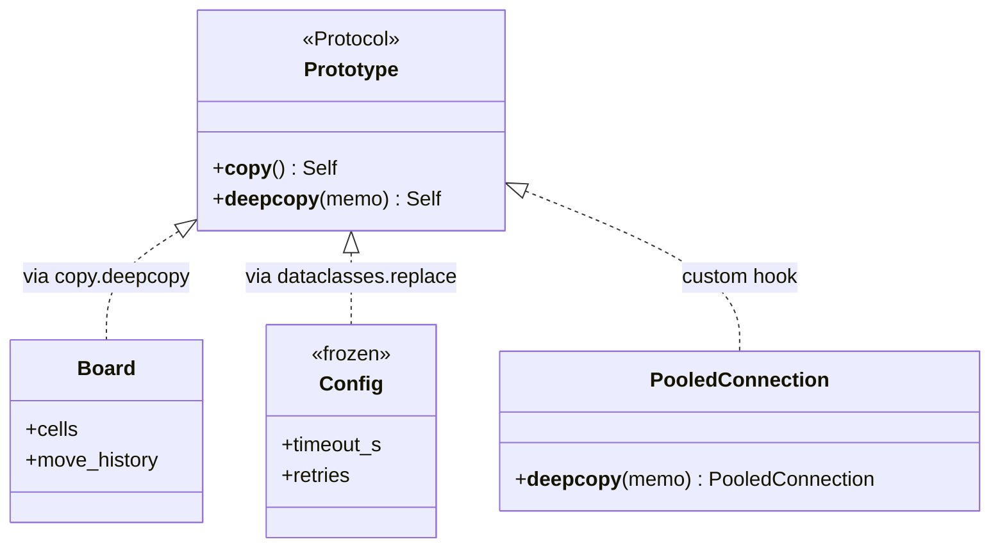

# Prototype

## Intent

Specify the kinds of objects to create using a prototypical instance, and create
new objects by copying the prototype. Construction is delegated to the object
itself.

## Use When

- Construction is more expensive than copying, such as loaded models, populated
  caches, or large graphs.
- You want to preserve runtime configuration, such as callbacks or registered
  handlers, that a fresh constructor would not reproduce.
- You want a `replace`-style API for immutable values.

## Prefer A Simpler Python Shape When

Python builds Prototype into the standard library: `copy.copy`, `copy.deepcopy`,
and `dataclasses.replace`. There is rarely a reason to define your own
`clone()`.

Use `dataclasses.replace` for immutable values:

```python
from dataclasses import dataclass, replace


@dataclass(frozen=True, slots=True)
class Config:
    timeout_s: float
    retries: int


base = Config(timeout_s=5.0, retries=3)
aggressive = replace(base, timeout_s=1.0)
```

Use `copy.deepcopy` when nested mutable data must not alias:

```python
from copy import deepcopy
from dataclasses import dataclass, field


@dataclass
class Board:
    cells: list[list[int]]
    move_history: list[tuple[int, int]] = field(default_factory=list)


initial = Board(cells=[[0] * 8 for _ in range(8)])
variant = deepcopy(initial)
variant.cells[0][0] = 1
```

## Structure



## Strict-Typed Python Sketch

For objects with non-trivial cloning, such as open file handles or pooled
connections, define `__copy__` or `__deepcopy__` and make the resource policy
explicit.

```python
from copy import deepcopy
from dataclasses import dataclass, field, replace


@dataclass
class Board:
    cells: list[list[int]]
    move_history: list[tuple[int, int]] = field(default_factory=list)


initial = Board(cells=[[0] * 8 for _ in range(8)])
variant = deepcopy(initial)
variant.cells[0][0] = 1


@dataclass(frozen=True, slots=True)
class Config:
    timeout_s: float
    retries: int


base = Config(timeout_s=5.0, retries=3)
aggressive = replace(base, timeout_s=1.0)


class PooledConnection:
    def __init__(self, dsn: str) -> None:
        self._dsn = dsn
        self._socket: object | None = None

    def __deepcopy__(self, memo: dict[int, object]) -> "PooledConnection":
        # Do not duplicate the live socket; give the clone a fresh one.
        return PooledConnection(self._dsn)
```

## Type-Safety Notes

`copy.deepcopy(x)` returns `x`'s exact type through typeshed overloads.
`dataclasses.replace` is generic over the dataclass type; keyword arguments that
do not match field names are rejected by type checkers. Avoid
`obj.__class__(**obj.__dict__)`: it is fragile, poorly typed, and breaks on
slots.

When defining `__deepcopy__`, use `dict[int, object]` for the `memo` parameter.
Keep resource semantics explicit: pooled connections, open files, and locks
usually need a fresh underlying resource rather than a byte-for-byte duplicate.

## Common Misuse

Do not use Prototype for stateless objects. Stateless instances are
interchangeable; constructing one is identical to copying. Do not shallow-copy
when the object graph requires deep copying; that creates silent aliasing bugs.

Hand-rolled `clone()` methods are another common failure. They miss fields when
a dataclass gains a new one. Prefer `dataclasses.replace` or `copy.deepcopy` and
let the language track the field list.

## Real-World Examples

- `dataclasses.replace(obj, field=value)` is Prototype with type-checked field
  names.
- `numpy.ndarray.copy()` and `pandas.DataFrame.copy(deep=True)` are Prototype
  with explicit shallow and deep semantics.
- `sklearn.base.clone(estimator)` produces a fresh estimator with the same
  hyperparameters but no fitted state.

## References

- Gamma et al., _Design Patterns_ (1994), pp. 117-126.
- Refactoring Guru,
  [Prototype](https://refactoring.guru/design-patterns/prototype).
- Python documentation, [`copy`](https://docs.python.org/3/library/copy.html)
  and
  [`dataclasses.replace`](https://docs.python.org/3/library/dataclasses.html#dataclasses.replace).
