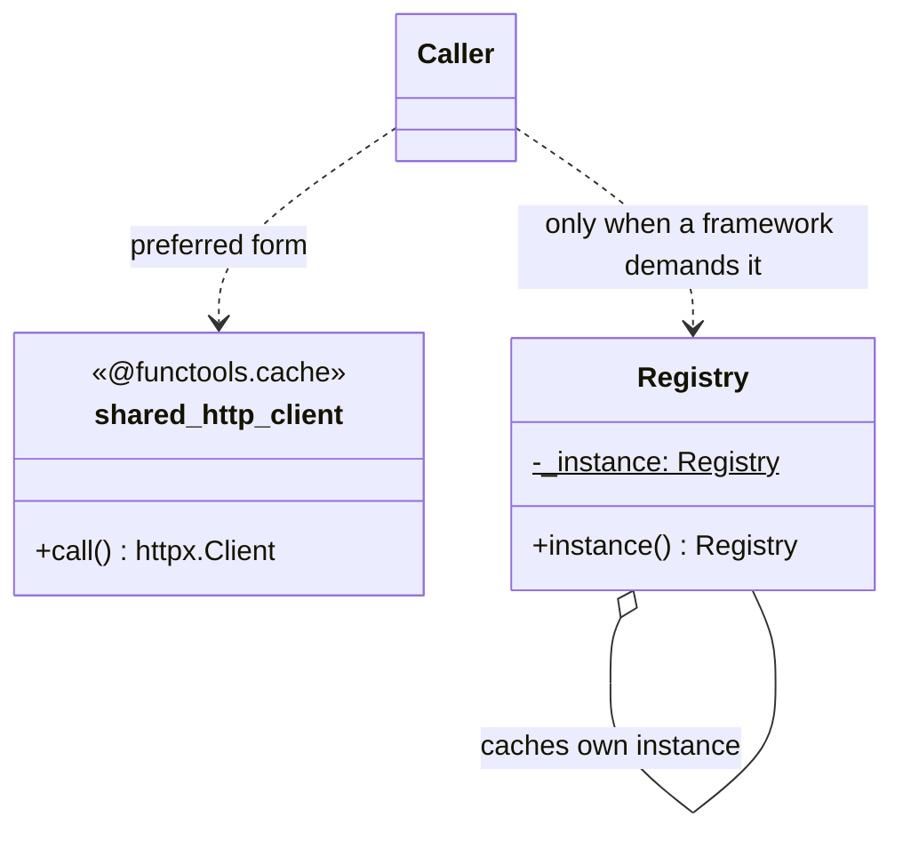

# Singleton

## Intent

Ensure a class has only one instance, and provide a global access point.

## Use When

Use the class Singleton shape almost never. Most useful "singleton" needs in
Python are one of these:

- Module-level state, because the import system caches `sys.modules[name]`.
- Dependency injection, where one instance is constructed at the composition
  root and passed to consumers.
- Memoization, where `functools.cache` produces a lazy, argument-keyed process
  singleton.

Reach for a class-level singleton only when a third-party framework requires
construction through a class and cannot accept an injected instance or factory
function.

## Prefer A Simpler Python Shape When

A Python module is already a singleton. Constants go at module top level; lazy
process-wide resources go behind `functools.cache`.

```python
from functools import cache
from typing import Final

import httpx


DEFAULT_TIMEOUT_S: Final[float] = 5.0
MAX_RETRIES: Final[int] = 3


@cache
def shared_http_client() -> httpx.Client:
    return httpx.Client(timeout=httpx.Timeout(connect=2.0, read=5.0))


def setup_test() -> None:
    shared_http_client.cache_clear()
```

Dependency injection is often cleaner still: construct one client at startup and
pass it to the services that need it. The important property is controlled
lifetime, not a magical constructor.

## Structure

The preferred Python structure is a cached factory function. The class version
exists only for frameworks that insist on class construction.



## Strict-Typed Python Sketch

Prefer the function form. `functools.cache` preserves the wrapped function's
signature, so type checkers treat `shared_http_client()` as returning
`httpx.Client`.

```python
from functools import cache

import httpx


@cache
def shared_http_client() -> httpx.Client:
    return httpx.Client(timeout=httpx.Timeout(5.0))


def setup_test() -> None:
    shared_http_client.cache_clear()
```

When a framework truly requires a class-owned singleton, keep the construction
explicit through a typed class method rather than hiding memoization behind
`__new__` or a metaclass.

```python
from typing import ClassVar


class Registry:
    _instance: ClassVar["Registry | None"] = None

    @classmethod
    def instance(cls) -> "Registry":
        if cls._instance is None:
            cls._instance = cls()
        return cls._instance
```

## Type-Safety Notes

Custom `__new__` tricks and Singleton metaclasses confuse static analysis
because a constructor looks like it creates a fresh object while runtime returns
a cached one. A typed class method keeps the cache visible. The bigger cost is
testability: a singleton that mutates global state is one of the fastest ways to
create cross-test pollution.

For cached functions, reset state explicitly in tests with
`shared_http_client.cache_clear()`. For dependency injection, construct a fresh
dependency per test or fixture scope.

## Common Misuse

Do not use Singleton for mutable state that tests will observe. Two tests
mutating the same registry corrupt each other's data. Inject the dependency from
the start.

Avoid a `Singleton` metaclass that hides instantiation behind `__call__`, making
`MyClass()` return the same instance every time. Static analysis sees a
constructor; runtime sees a memoized function; the gap creates confusing
failures.

## Real-World Examples

- `logging.getLogger(name)` is a per-name singleton: factory plus cache, not one
  global object.
- `decimal.getcontext()` returns a per-thread `Context`, which is a more honest
  pattern for state-bearing globals.
- `gettext.gettext` lazily binds to a translation catalog for the active locale.

## References

- Gamma et al., _Design Patterns_ (1994), pp. 127-134.
- Refactoring Guru,
  [Singleton](https://refactoring.guru/design-patterns/singleton).
- Brandon Rhodes,
  [The Singleton Pattern](https://python-patterns.guide/gang-of-four/singleton/).
