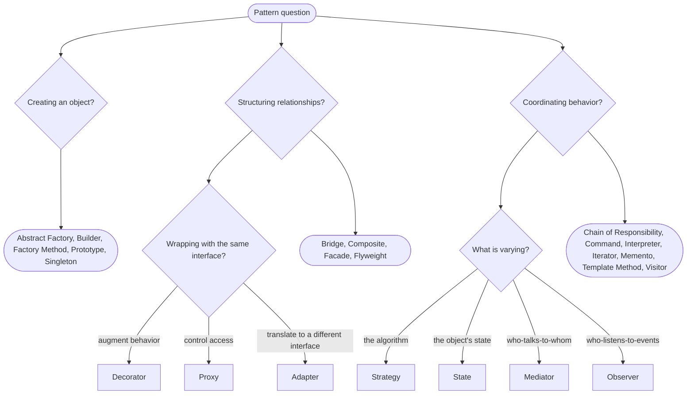

# GoF Design Patterns

Strict-typed Python 3.13+ navigation for the Gang of Four catalogue.

Use the individual pages when you already know the pattern. Use this index when you are choosing among categories or checking whether a simpler Python shape should replace the classic OO form.

## Creational

- [Abstract Factory](creational/abstract-factory.md)
- [Builder](creational/builder.md)
- [Factory Method](creational/factory-method.md)
- [Prototype](creational/prototype.md)
- [Singleton](creational/singleton.md)

## Structural

- [Adapter](structural/adapter.md)
- [Bridge](structural/bridge.md)
- [Composite](structural/composite.md)
- [Decorator](structural/decorator.md)
- [Facade](structural/facade.md)
- [Flyweight](structural/flyweight.md)
- [Proxy](structural/proxy.md)

## Behavioral

- [Chain of Responsibility](behavioral/chain-of-responsibility.md)
- [Command](behavioral/command.md)
- [Interpreter](behavioral/interpreter.md)
- [Iterator](behavioral/iterator.md)
- [Mediator](behavioral/mediator.md)
- [Memento](behavioral/memento.md)
- [Observer](behavioral/observer.md)
- [State](behavioral/state.md)
- [Strategy](behavioral/strategy.md)
- [Template Method](behavioral/template-method.md)
- [Visitor](behavioral/visitor.md)

Interpreter is part of the GoF catalogue but is not listed in Refactoring Guru's public catalog list; the other behavioral pages keep Refactoring Guru pattern URLs in their references.

## Choosing A Pattern

| Question | Pattern or alternative |
| --- | --- |
| How do I decide which class to construct? | [Factory Method](creational/factory-method.md), or a top-level function |
| How do I produce coordinated families of products? | [Abstract Factory](creational/abstract-factory.md), or a Protocol of product protocols |
| How do I build an object with many optional or ordered arguments? | [Builder](creational/builder.md), or a frozen dataclass |
| How do I ensure one process-wide instance? | Module plus `functools.cache`; rarely [Singleton](creational/singleton.md) |
| How do I copy an existing object? | [Prototype](creational/prototype.md) with `copy.deepcopy` or `dataclasses.replace` |
| How do I make two incompatible types talk? | [Adapter](structural/adapter.md) |
| How do I separate two orthogonal axes of variation? | [Bridge](structural/bridge.md) |
| How do I treat a tree of objects uniformly? | [Composite](structural/composite.md) |
| How do I add behavior without modifying the wrapped class? | [Decorator](structural/decorator.md) |
| How do I hide a complex subsystem? | [Facade](structural/facade.md) |
| How do I reduce memory for many similar objects? | [Flyweight](structural/flyweight.md) |
| How do I control access to an object? | [Proxy](structural/proxy.md) |
| How do I compose a configurable pipeline of handlers? | [Chain of Responsibility](behavioral/chain-of-responsibility.md) |
| How do I queue, log, or undo an action? | [Command](behavioral/command.md) |
| How do I evaluate a small DSL? | [Interpreter](behavioral/interpreter.md), or use `lark` |
| How do I traverse a structure lazily? | [Iterator](behavioral/iterator.md), usually `yield from` |
| How do I coordinate many objects without many-to-many coupling? | [Mediator](behavioral/mediator.md) |
| How do I save and restore state? | [Memento](behavioral/memento.md) |
| How do I notify multiple subscribers of a change? | [Observer](behavioral/observer.md) |
| How do I represent state-dependent behavior? | [State](behavioral/state.md) |
| How do I swap an algorithm at runtime? | [Strategy](behavioral/strategy.md) |
| How do I share a workflow across variants? | [Template Method](behavioral/template-method.md), usually composition |
| How do I dispatch operations across a fixed type hierarchy? | [Visitor](behavioral/visitor.md) |

## Pattern Relationships

- Composite + Visitor: AST plus operations. The AST is the Composite; the operations are Visitors.
- Composite + Iterator: walk a tree. `__iter__` returns a generator; `yield from` composes recursion.
- Strategy + Observer: a domain event triggers a strategy whose choice is itself configurable.
- Command + Memento + Chain of Responsibility: undoable middleware captures a memento before applying, then authorizes, runs, and logs through a chain.
- State + Strategy: State is "behavior varies by which state I am in"; Strategy is "behavior varies by which algorithm I was given."
- Mediator + Observer: a Mediator often uses Observer internally to subscribe to participant events and broadcast coordinated reactions.
- Template Method approximates Strategy: the composition form of Template Method is a Strategy per step.

## References

- Gamma, Erich; Helm, Richard; Johnson, Ralph; Vlissides, John. *Design Patterns: Elements of Reusable Object-Oriented Software*. Addison-Wesley Professional Computing Series, 1994.
- Refactoring Guru, [Design Patterns](https://refactoring.guru/design-patterns).
- Brandon Rhodes, [Python Design Patterns](https://python-patterns.guide/).
