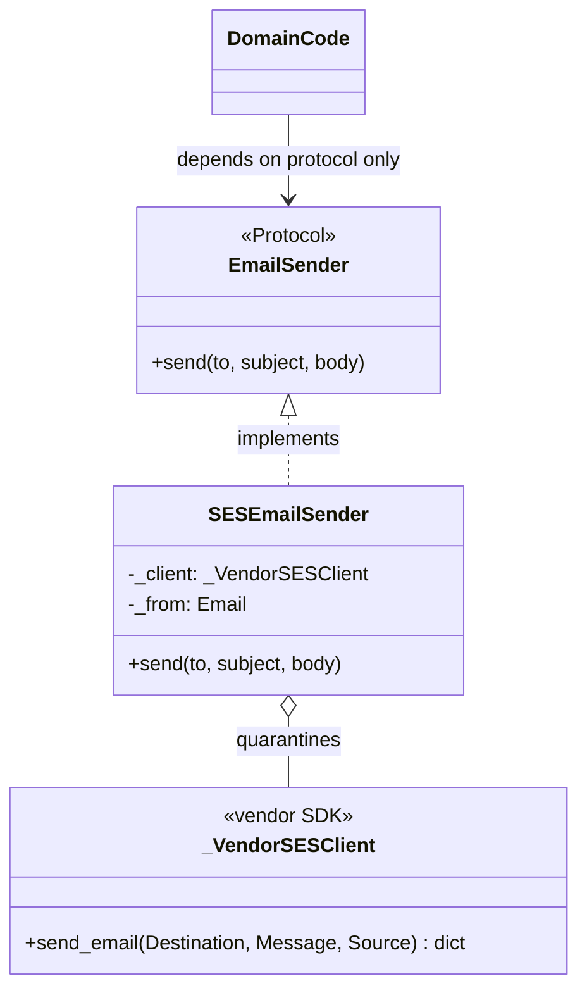

# Adapter

## Intent

Convert the interface of a class into another interface clients expect. Adapter
lets classes work together that could not otherwise because of incompatible
interfaces. In Python, the canonical use is wrapping a vendor SDK to satisfy a
`Protocol` your domain depends on.

## Use When

- An external library exposes an API that does not match your domain shape.
- Legacy code's interface is wrong but you cannot change it.
- You want to keep vendor types out of your domain types; the adapter is the
  quarantine.
- The boundary needs validation or translation from a foreign wire shape into a
  domain type.

## Prefer A Simpler Python Shape When

Do not create a trivial forwarding adapter that adds nothing and has every
method as `return self._inner.x(...)`. If the existing interface already
conforms, import it directly. If you are anticipating a future swap, wait for
the second implementation.

When the only mismatch is data shape, prefer a boundary parser such as a
Pydantic model or a small conversion function over a class hierarchy. The
important property is the quarantine, not the ceremony.

## Structure

An object adapter composes the incompatible object and presents the target
protocol. Domain code depends on the protocol; the adapter is the only object
that knows the vendor shape.



## Strict-Typed Python Sketch

Object adapter using composition:

```python
from typing import NewType, Protocol


Email = NewType("Email", str)


class EmailSender(Protocol):
    def send(self, to: Email, subject: str, body: str) -> None: ...


class _VendorSESClient:
    """Third-party type. We do not own its shape."""

    def send_email(
        self,
        *,
        Destination: dict[str, list[str]],
        Message: dict[str, dict[str, str]],
        Source: str,
    ) -> dict[str, str]: ...


class SESEmailSender:
    """Adapter: presents EmailSender, delegates to _VendorSESClient."""

    def __init__(self, client: _VendorSESClient, from_address: Email) -> None:
        self._client = client
        self._from = from_address

    def send(self, to: Email, subject: str, body: str) -> None:
        self._client.send_email(
            Destination={"ToAddresses": [to]},
            Message={
                "Subject": {"Data": subject},
                "Body": {"Text": {"Data": body}},
            },
            Source=self._from,
        )
```

The vendor types stay quarantined inside `SESEmailSender`. Domain code depends
only on `EmailSender`; swapping to `SendGridEmailSender` is a wiring change at
the composition root.

When the vendor hands you an untyped payload, the cleanest adapter is not a
broad cast. It is a validator that types the foreign payload at the boundary.
The vendor model stays private to the adapter; domain code sees only the typed
domain `Receipt`.

```python
from dataclasses import dataclass
from typing import Annotated

from pydantic import BaseModel, ConfigDict, Field


class _VendorReceipt(BaseModel):
    """Validates the vendor's JSON shape; rejects missing or extra fields."""

    model_config = ConfigDict(extra="forbid")

    message_id: Annotated[str, Field(alias="MessageId", min_length=1)]
    request_id: Annotated[str, Field(alias="RequestId", min_length=1)]


@dataclass(frozen=True, slots=True)
class Receipt:
    """Domain type. The adapter never returns the vendor model."""

    id: str
    request_id: str


class SESReceiptAdapter:
    def parse(self, vendor_response: dict[str, object]) -> Receipt:
        v = _VendorReceipt.model_validate(vendor_response)
        return Receipt(id=v.message_id, request_id=v.request_id)
```

The validator catches typoed field names, missing keys, and unknown extras at
the parse step, not as a late `KeyError` at first read.

## Type-Safety Notes

Adapters are the right place for a narrow, documented cast if a vendor exposes
no usable type information and you must hand back a typed domain object.
Annotate that cast with the vendor documentation reference. The protocol stays
narrow, the unsafe boundary is contained, and no other module sees the vendor
shape.

Prefer validation when possible. A Pydantic model or dataclass parser gives the
type checker and runtime the same boundary: foreign data enters once, domain
data leaves typed.

## Common Misuse

The kitchen-sink adapter exposes both the new interface and the underlying
methods, defeating the quarantine. If callers reach through your adapter to the
vendor SDK, the adapter is only decorative.

Another common misuse is wrapping every dependency "for consistency." Adapter is
valuable when it changes or quarantines an interface; otherwise it is just
another object to configure and debug.

## Real-World Examples

- `io.TextIOWrapper` adapts a binary `BufferedIOBase` into the text-mode
  `TextIO` interface.
- `argparse.ArgumentParser` adapts CLI arguments into a typed `Namespace`.
- `unittest.mock.MagicMock` adapts arbitrary attribute access into recorded call
  objects.

## References

- Gamma et al., _Design Patterns_ (1994), pp. 139-150.
- Refactoring Guru, [Adapter](https://refactoring.guru/design-patterns/adapter).
