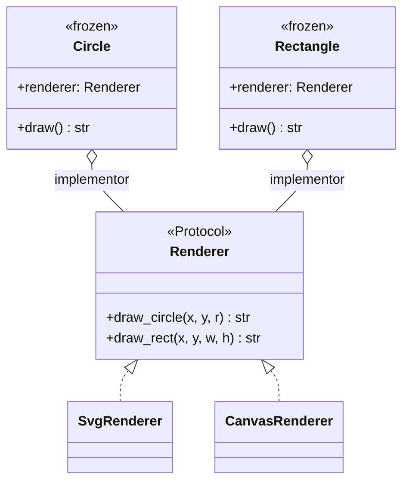

# Bridge

## Intent

Decouple an abstraction from its implementation so the two can vary independently. Bridge
replaces the inheritance explosion that arises when an `M`-axis abstraction crosses an
`N`-axis implementation: instead of `M * N` subclasses such as `SquareSvgRenderer` and
`SquareCanvasRenderer`, you have `M + N` classes linked by composition.

## Use When

- Two orthogonal axes of variation would otherwise multiply subclasses.
- The implementation can change at runtime per instance.
- You want to hide implementation details from clients of the abstraction.
- The implementation axis is a coordinated set of operations, not a single callback.

## Prefer A Simpler Python Shape When

If there is only one implementation or only one abstraction, Bridge collapses to Strategy or
to a normal class. The pattern earns its keep when both axes will plausibly grow.

For a single varying algorithm, prefer a function parameter, a small `Protocol`, or Strategy.
For simple rendering options that never form an independent family, prefer keyword arguments
or a small configuration object.

## Structure

Two hierarchies are linked by composition. The abstraction owns a reference to the implementor
protocol and delegates the implementation-specific work.



## Strict-Typed Python Sketch

Shape x Renderer is the canonical example. The shape delegates to a renderer rather than
inheriting from one.

```python
from dataclasses import dataclass
from typing import Protocol


class Renderer(Protocol):
    """The implementor axis."""

    def draw_circle(self, x: float, y: float, radius: float) -> str: ...
    def draw_rect(self, x: float, y: float, w: float, h: float) -> str: ...


class SvgRenderer:
    def draw_circle(self, x: float, y: float, radius: float) -> str:
        return f'<circle cx="{x}" cy="{y}" r="{radius}"/>'

    def draw_rect(self, x: float, y: float, w: float, h: float) -> str:
        return f'<rect x="{x}" y="{y}" width="{w}" height="{h}"/>'


class CanvasRenderer:
    def draw_circle(self, x: float, y: float, radius: float) -> str:
        return f"ctx.arc({x},{y},{radius},0,2*Math.PI);"

    def draw_rect(self, x: float, y: float, w: float, h: float) -> str:
        return f"ctx.fillRect({x},{y},{w},{h});"


@dataclass(frozen=True, slots=True)
class Circle:
    """The abstraction axis. Delegates to a Renderer."""

    renderer: Renderer
    x: float
    y: float
    radius: float

    def draw(self) -> str:
        return self.renderer.draw_circle(self.x, self.y, self.radius)


@dataclass(frozen=True, slots=True)
class Rectangle:
    renderer: Renderer
    x: float
    y: float
    w: float
    h: float

    def draw(self) -> str:
        return self.renderer.draw_rect(self.x, self.y, self.w, self.h)


svg_circle = Circle(renderer=SvgRenderer(), x=10, y=10, radius=5)
canvas_rect = Rectangle(renderer=CanvasRenderer(), x=0, y=0, w=100, h=50)
```

The two axes are selected independently. Adding `PdfRenderer` does not require new shape
classes; adding `Triangle` does not require renderer subclasses per triangle variant.

## Type-Safety Notes

`Renderer` is a `Protocol`; the shape holds a renderer field. The two axes are independently
checkable. If you make `Renderer` an `ABC` and have `Shape` subclass it, you have re-coupled
the axes. That is Strategy or Template Method, not Bridge.

Bridge differs from Strategy by scale. Strategy varies one algorithm at a time within a
single class. Bridge separates two whole hierarchies. If your strategies form a coordinated
set of methods called from many points in a varying outer hierarchy, you have a Bridge.

## Common Misuse

A Bridge with one renderer and a comment promising another later is premature indirection.
Wait until the second axis is real enough to shape the protocol.

Another misuse is letting the abstraction inspect concrete implementor types. Once `Circle`
has `isinstance(renderer, SvgRenderer)` branches, the bridge has become a disguised
conditional.

## Real-World Examples

- `logging.Logger` x `logging.Handler`: a logger does not know whether the handler writes to
  a file, a socket, or stderr.
- `matplotlib.figure.Figure` x backend (`Agg`, `PDF`, `SVG`, `MacOSX`): the figure is the
  abstraction, the backend is the implementor.
- `sqlalchemy.Engine` x `Dialect`: engine is the abstraction over connection pooling and
  transactions; dialect is the implementor for DBMS-specific SQL generation.

## References

- Gamma et al., *Design Patterns* (1994), pp. 151-161.
- Refactoring Guru, [Bridge](https://refactoring.guru/design-patterns/bridge).
- Freeman & Robson, *Head First Design Patterns* (2nd ed., 2020), ch. 12.
