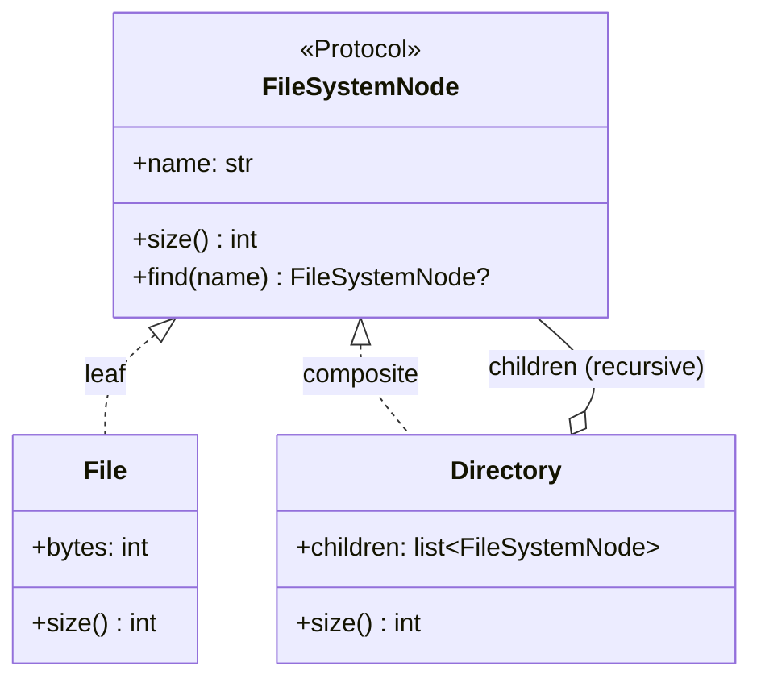

# Composite

## Intent

Compose objects into tree structures to represent part-whole hierarchies.
Composite lets clients treat individual objects and compositions uniformly
through a shared interface.

## Use When

- The domain is recursive: filesystems, ASTs, UI widget trees, organization
  charts, or expression trees.
- Operations should work on a single leaf and a deep tree without case-splitting
  at every call site.
- Callers benefit from a uniform interface for traversal, aggregation, or
  search.
- You need either open extension through a protocol or closed exhaustiveness
  through a union.

## Prefer A Simpler Python Shape When

Do not force flat data into a Composite. A single-level "container of leaves" is
usually just a list, dictionary, or dataclass with a collection field.

Do not create a leaf that secretly supports container methods such as
`add_child`. That is the GoF transparency-versus-safety trade-off, and the safe
form, separate leaf and composite types, is almost always right in Python.

## Structure

The recursive aggregation is the pattern: a `Directory` holds `FileSystemNode`
children, which may themselves be `Directory` instances.



## Strict-Typed Python Sketch

Protocol-based polymorphism gives an open Composite.

```python
from dataclasses import dataclass
from typing import Protocol


class FileSystemNode(Protocol):
    name: str

    def size(self) -> int: ...
    def find(self, name: str) -> "FileSystemNode | None": ...


@dataclass
class File:
    name: str
    bytes: int

    def size(self) -> int:
        return self.bytes

    def find(self, name: str) -> FileSystemNode | None:
        return self if self.name == name else None


@dataclass
class Directory:
    name: str
    children: list[FileSystemNode]

    def size(self) -> int:
        return sum(child.size() for child in self.children)

    def find(self, name: str) -> FileSystemNode | None:
        if self.name == name:
            return self
        for child in self.children:
            found = child.find(name)
            if found is not None:
                return found
        return None
```

A discriminated-union variant is useful when callers benefit from explicit case
analysis:

```python
from dataclasses import dataclass


@dataclass(frozen=True, slots=True)
class File:
    name: str
    bytes: int


@dataclass(frozen=True, slots=True)
class Directory:
    name: str
    children: list["FsNode"]


type FsNode = File | Directory


def total_size(node: FsNode) -> int:
    match node:
        case File(bytes=b):
            return b
        case Directory(children=cs):
            return sum(total_size(c) for c in cs)
```

## Type-Safety Notes

The protocol form is open: a third party can add `SymLink` without touching the
existing module. The union form is closed: adding `SymLink` requires updating
every `match`, but the checker can tell you where when paired with
exhaustiveness checks.

Choose closed unions when you own the type set and want exhaustiveness. Choose
protocols when extensibility outranks exhaustiveness.

## Common Misuse

A Composite where leaves expose `add_child(...)` and raise `NotImplementedError`
breaks its own interface contract. Either both leaf and composite genuinely
support the method, or split the interface so the leaf does not claim to.

Another misuse is putting parent traversal, mutation, rendering, and persistence
all on the node protocol. Keep the shared interface narrow; put separate
operations in visitors, functions, or services when they are not intrinsic to
the tree.

## Real-World Examples

- `pathlib.Path` is a Composite-like API: the same methods work on paths to
  files and directories, with directory-specific methods such as `iterdir` and
  `glob`.
- `ast.AST` and its subclasses (`Module`, `FunctionDef`, `Expr`) form a
  Composite.
- `tkinter` and `PySide6` widget trees: a `Frame` contains widgets; widgets
  respond to layout and event traversal uniformly.

## References

- Gamma et al., _Design Patterns_ (1994), pp. 163-174.
- Refactoring Guru,
  [Composite](https://refactoring.guru/design-patterns/composite).
- Brandon Rhodes,
  [_python-patterns.guide_, "Composite"](https://python-patterns.guide/gang-of-four/composite/).
