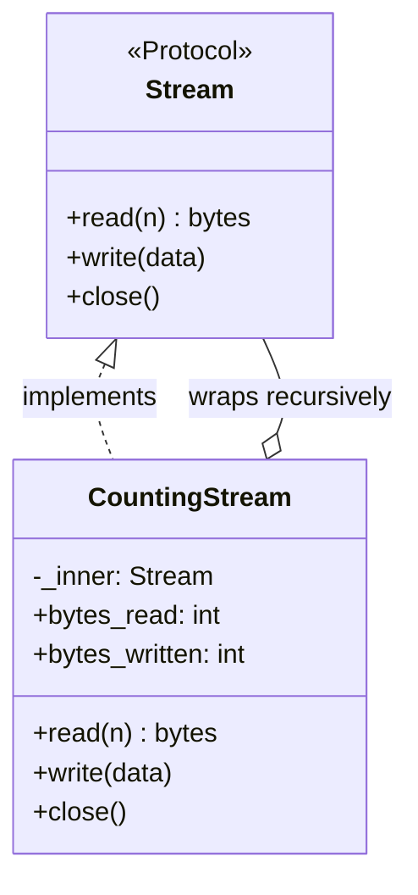

# Decorator

## Intent

Attach additional responsibilities to an object dynamically. Decorator provides a flexible
alternative to subclassing for extending functionality.

Python has two related senses: the GoF structural pattern, where an object wraps another
object, and the `@decorator` syntax, where a function wraps another function. Both solve the
same problem; the syntax form handles most Python cases.

## Use When

- You need cross-cutting behavior such as logging, timing, retry, caching, or authorization
  without modifying the wrapped object.
- Behaviors should stack compositionally, where wrapping order is execution order.
- The wrapper can implement the same interface as the wrapped object.
- Subclassing would create a matrix of feature combinations.

## Prefer A Simpler Python Shape When

If you only need to run a small block before and after an operation, use a context manager.
If the behavior is one explicit step in a workflow, use a function call. If you are adding a
method that callers expect, use Adapter or a real interface change.

Do not stack wrappers until the origin of behavior is impossible to see. At three or more
wrappers, consider a pipeline, middleware chain, or a single composed handler.

## Structure

The wrapper implements the same protocol it wraps. Composition is recursive, which enables
`LoggedRetryStream(CountingStream(BaseStream))`.



## Strict-Typed Python Sketch

Function-decorator form using PEP 695 generic syntax and `ParamSpec` behavior to preserve the
wrapped function's signature:

```python
import functools
import logging
import time
from collections.abc import Callable


logger = logging.getLogger(__name__)


def timed[**P, ReturnT](func: Callable[P, ReturnT]) -> Callable[P, ReturnT]:
    @functools.wraps(func)
    def wrapper(*args: P.args, **kwargs: P.kwargs) -> ReturnT:
        start = time.monotonic()
        try:
            return func(*args, **kwargs)
        finally:
            logger.info(
                "call",
                extra={
                    "func": func.__qualname__,
                    "elapsed_s": time.monotonic() - start,
                },
            )

    return wrapper


@timed
def compute(x: int, y: int) -> int:
    return x + y
```

Structural form for stacking behavior on an object with a larger interface:

```python
from typing import Protocol


class Stream(Protocol):
    def read(self, n: int) -> bytes: ...
    def write(self, data: bytes) -> None: ...
    def close(self) -> None: ...


class CountingStream:
    def __init__(self, inner: Stream) -> None:
        self._inner = inner
        self.bytes_read = 0
        self.bytes_written = 0

    def read(self, n: int) -> bytes:
        data = self._inner.read(n)
        self.bytes_read += len(data)
        return data

    def write(self, data: bytes) -> None:
        self._inner.write(data)
        self.bytes_written += len(data)

    def close(self) -> None:
        self._inner.close()
```

## Type-Safety Notes

Use `ParamSpec` or PEP 695 syntax to preserve signatures across function decoration. Without
it, `@timed` collapses the function to an imprecise callable type.

For class decorators that add attributes, prefer composition over class-mutating decoration.
Checkers handle composition cleanly; mutation often requires boundary casts and makes the
object's public shape less obvious.

Decorator and Proxy have the same structural shape. Decorator augments behavior; Proxy
controls access. The syntactic distinction in Python is invisible, so pick the name that
communicates intent.

## Common Misuse

A decorator that raises `AttributeError` for half the wrapped object's methods because the
author only forwarded the methods they cared about is not a valid implementation of the
interface. If the decorator claims to implement an interface, it must implement all of it.

Another misuse is hiding essential behavior behind a long stack of annotations. Decoration is
best when the added behavior is cross-cutting and unsurprising, not when it changes the core
meaning of the operation.

## Real-World Examples

- `contextlib.contextmanager` is a generator-to-context-manager Decorator.
- `functools.lru_cache` and `functools.cache` are caching decorators that preserve signatures.
- `gzip.GzipFile` wraps a file-like object, transparently compressing on write; it is a
  structural Decorator over the file protocol.

## References

- Gamma et al., *Design Patterns* (1994), pp. 175-184.
- Refactoring Guru, [Decorator](https://refactoring.guru/design-patterns/decorator).
- PEP 318, [Decorators for Functions and Methods](https://peps.python.org/pep-0318/).
- PEP 612, [Parameter Specification Variables](https://peps.python.org/pep-0612/).
