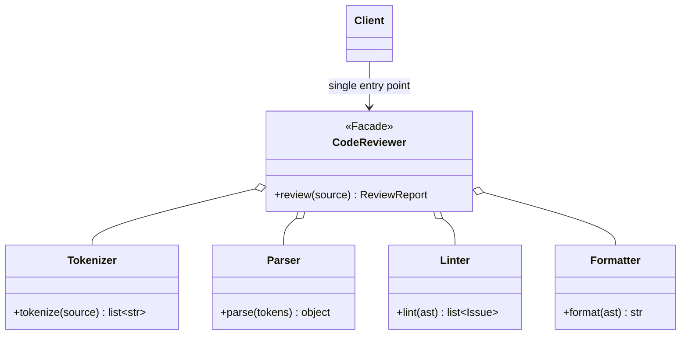

# Facade

## Intent

Provide a unified, simplified interface to a set of interfaces in a subsystem.
Facade defines a higher-level interface that makes the subsystem easier to use,
hiding the collaboration choreography among its components.

## Use When

- A subsystem exposes many low-level primitives that must be combined in
  non-obvious ways to do the thing most callers actually want.
- You want to enforce a particular usage pattern as the default.
- You are pruning a public API.
- Inner subsystem types should remain private to the package.

## Prefer A Simpler Python Shape When

If the "simple" facade hides options callers genuinely need, do not keep adding
parameters until it becomes the subsystem it was meant to hide. Extract a
Builder, expose a smaller set of explicit use-case functions, or accept that the
underlying complexity is real.

If there is no underlying collaboration, a module-level function is often
enough. A facade should delegate; if it does not, the subsystem probably does
not exist.

## Structure

The client talks to one public entry point. The facade coordinates the subsystem
objects and returns a stable public result type.



## Strict-Typed Python Sketch

```python
from dataclasses import dataclass


@dataclass(frozen=True, slots=True)
class Issue:
    line: int
    message: str
    severity: str


@dataclass(frozen=True, slots=True)
class Ast:
    nodes: tuple[str, ...]


@dataclass(frozen=True, slots=True)
class ReviewReport:
    issues: list[Issue]
    formatted: str


class Tokenizer:
    def tokenize(self, source: str) -> list[str]: ...


class Parser:
    def parse(self, tokens: list[str]) -> Ast: ...


class Linter:
    def lint(self, ast: Ast) -> list[Issue]: ...


class Formatter:
    def format(self, ast: Ast) -> str: ...


class CodeReviewer:
    """Facade: the one thing most callers want."""

    def __init__(
        self,
        tokenizer: Tokenizer,
        parser: Parser,
        linter: Linter,
        formatter: Formatter,
    ) -> None:
        self._tokenizer = tokenizer
        self._parser = parser
        self._linter = linter
        self._formatter = formatter

    def review(self, source: str) -> ReviewReport:
        tokens = self._tokenizer.tokenize(source)
        ast = self._parser.parse(tokens)
        issues = self._linter.lint(ast)
        formatted = self._formatter.format(ast)
        return ReviewReport(issues=issues, formatted=formatted)


def default_reviewer() -> CodeReviewer:
    return CodeReviewer(Tokenizer(), Parser(), Linter(), Formatter())
```

## Type-Safety Notes

The facade's method signatures are the subsystem's public API. Inner types stay
private to the package; only the facade and stable result types are exported.

Resist exposing inner objects through accessors such as `reviewer.parser`, even
"just in case someone needs it." That defeats the encapsulation. If callers need
parser access, either the facade is too narrow or there are two public use
cases.

Facade simplifies a subsystem you own. Adapter translates an incompatible
interface you do not own. If you find yourself writing a facade over a vendor
SDK, you usually have an Adapter, and possibly a Mediator if multiple vendor
calls coordinate.

## Common Misuse

A "facade" that is a god class containing every operation in the subsystem, with
no internal collaborators, is a flat module masquerading as a class. A facade
should delegate.

Another misuse is using Facade to hide important failure modes. Simplifying the
happy path is good; turning recoverable subsystem errors into vague exceptions
makes the public API less usable, not more.

## Real-World Examples

- `requests.get(url)` is a facade over connection pooling, retry, encoding, and
  socket management.
- `subprocess.run(...)` is a facade over `Popen`, `communicate`, return-code
  handling, and timeout management.
- `pathlib.Path("x").read_text()` is a facade over open, read, close, and
  decode.

## References

- Gamma et al., _Design Patterns_ (1994), pp. 185-194.
- Refactoring Guru, [Facade](https://refactoring.guru/design-patterns/facade).
- Freeman & Robson, _Head First Design Patterns_ (2nd ed., 2020), ch. 7.
