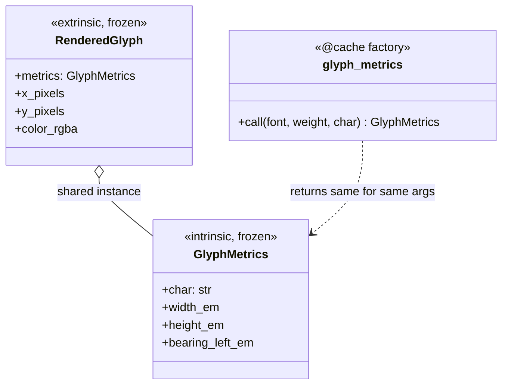

# Flyweight

## Intent

Use sharing to support large numbers of fine-grained objects efficiently. Flyweight
distinguishes intrinsic state, which is shared, immutable, and context-free, from extrinsic
state, which is unique and supplied by the client at use time.

Millions of conceptual objects can then be represented by a small pool of shared flyweight
instances.

## Use When

Memory pressure is the trigger. The pattern is invisible except when:

- You have millions of similar objects and the heap shows it.
- The objects have a small set of distinct intrinsic configurations.
- Equality between flyweights should be reference equality through interning.
- Extrinsic state can be supplied by the client without being stored on the flyweight.

## Prefer A Simpler Python Shape When

Do not use Flyweight as a general performance charm. The cost is real: cache management,
lifetime ambiguity, reference-identity assumptions, and interning bugs. Profile first.

If there are only thousands of objects, a frozen dataclass with `slots=True` may be enough.
If construction is expensive but object count is modest, use ordinary caching without making
reference identity part of the domain contract.

## Structure

Intrinsic state is shared through a factory cache. Extrinsic state is held per use and points
at the shared intrinsic object.



## Strict-Typed Python Sketch

Python interns small integers and some strings automatically. For domain-level interning, use
a factory with a cache.

```python
from dataclasses import dataclass
from functools import cache


@dataclass(frozen=True, slots=True)
class GlyphMetrics:
    """Intrinsic state: shared across every rendered character."""

    char: str
    width_em: float
    height_em: float
    bearing_left_em: float


def _measure_glyph_from_font_file(
    font_family: str,
    weight: int,
    char: str,
) -> tuple[float, float, float]:
    return (0.5 + len(char) * 0.1, 1.0, 0.05)


@cache
def glyph_metrics(font_family: str, weight: int, char: str) -> GlyphMetrics:
    """Flyweight factory. Returns the same instance for identical arguments."""

    width, height, bearing = _measure_glyph_from_font_file(font_family, weight, char)
    return GlyphMetrics(
        char=char,
        width_em=width,
        height_em=height,
        bearing_left_em=bearing,
    )


@dataclass(frozen=True, slots=True)
class RenderedGlyph:
    """Extrinsic state: unique per rendered character."""

    metrics: GlyphMetrics
    x_pixels: float
    y_pixels: float
    color_rgba: tuple[int, int, int, int]


assert glyph_metrics("Helvetica", 700, "a") is glyph_metrics("Helvetica", 700, "a")
```

For domain identity types, explicit interning can be expressed with a weak-value dictionary:

```python
import weakref
from typing import Final, Self, final


@final
class Sku:
    _pool: weakref.WeakValueDictionary[str, "Sku"] = weakref.WeakValueDictionary()

    def __new__(cls, value: str) -> Self:
        existing = cls._pool.get(value)
        if existing is not None:
            return existing
        instance = super().__new__(cls)
        cls._pool[value] = instance
        return instance

    def __init__(self, value: str) -> None:
        if not hasattr(self, "_value"):
            self._value: Final[str] = value
```

## Type-Safety Notes

`functools.cache` preserves the factory's signature. Reference equality is what makes
Flyweight work, but document it explicitly because Python's equality for frozen dataclasses
already gives value equality.

The intrinsic-state class must be frozen. A mutable flyweight shared across the program turns
one local mutation into global state. Keep extrinsic state out of the cached object, or the
cache will grow with each context and lose the memory benefit.

## Common Misuse

A "flyweight" that stores extrinsic state such as `font_size` inside `GlyphMetrics` causes
each context to produce a distinct cached entry. The cache balloons, memory savings vanish,
and the design becomes a slow object pool.

Another misuse is assuming interning is free. Weak dictionaries, cache eviction, and object
lifetime all affect behavior. Make the identity contract explicit and test it where code
depends on `is`.

## Real-World Examples

- Python interns small integers (`-5` to `256`) and short ASCII identifiers.
- `sys.intern(s)` interns arbitrary strings; it is useful for symbol tables in compilers.
- `re.compile` caches recent patterns. The compiled pattern is the flyweight; the match is
  the extrinsic state.

## References

- Gamma et al., *Design Patterns* (1994), pp. 195-206.
- Refactoring Guru, [Flyweight](https://refactoring.guru/design-patterns/flyweight).
