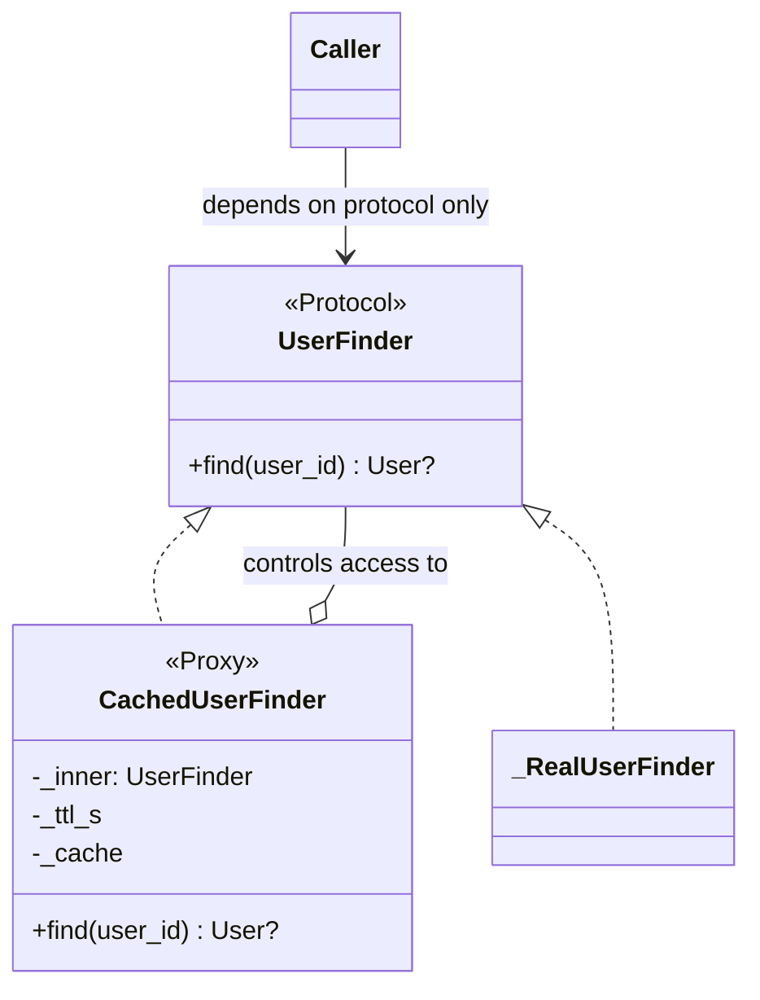

# Proxy

## Intent

Provide a surrogate or placeholder for another object to control access to it. Proxy and the
wrapped object share an interface; the proxy adds access control such as lazy loading, remote
invocation, caching, authorization, or logging.

## Use When

- Construction of the real object is expensive and may be avoided.
- The real object lives elsewhere, such as another process or host.
- Access must be moderated by policy.
- Repeated calls with the same arguments are wasteful.
- Callers should depend on the same abstraction whether they receive the proxy or the real
  subject.

## Prefer A Simpler Python Shape When

If you are wrapping because you want a different shape, use Adapter. If you are only adding a
tiny optional concern at one call site, use an explicit function or helper. Do not proxy "just
in case"; each layer is one more thing to step through in a debugger.

If a standard library descriptor or cached property expresses the access control directly,
prefer that over creating a subject/proxy pair.

## Structure

Proxy and real subject share an interface. The caller cannot tell them apart through the type
it depends on.



## Strict-Typed Python Sketch

Caching proxy: the same protocol as the wrapped finder, with a TTL.

```python
import time
from dataclasses import dataclass
from typing import NewType, Protocol


UserId = NewType("UserId", str)


@dataclass(frozen=True, slots=True)
class User:
    id: UserId
    name: str


class UserFinder(Protocol):
    def find(self, user_id: UserId) -> User | None: ...


class CachedUserFinder:
    def __init__(self, inner: UserFinder, ttl_s: float) -> None:
        self._inner = inner
        self._ttl_s = ttl_s
        self._cache: dict[UserId, tuple[User | None, float]] = {}

    def find(self, user_id: UserId) -> User | None:
        now = time.monotonic()
        cached = self._cache.get(user_id)
        if cached is not None and now - cached[1] < self._ttl_s:
            return cached[0]
        result = self._inner.find(user_id)
        self._cache[user_id] = (result, now)
        return result
```

Virtual proxy for lazy initialization of an expensive resource:

```python
from collections.abc import Callable


class HeavyResource:
    def query(self, q: str) -> list[dict[str, object]]: ...


class LazyHeavyResource:
    def __init__(self, factory: Callable[[], HeavyResource]) -> None:
        self._factory = factory
        self._inner: HeavyResource | None = None

    def query(self, q: str) -> list[dict[str, object]]:
        if self._inner is None:
            self._inner = self._factory()
        return self._inner.query(q)
```

## Type-Safety Notes

The proxy implements the same protocol as the wrapped object. Callers do not need to know the
proxy exists because they depend on the abstraction. If you add methods to the proxy that are
not on the protocol, you have a Decorator or Adapter, not a Proxy.

Proxy and Decorator have the same structural shape. Decorator adds behavior; Proxy controls
access. In Python the boundary is fuzzy, because a caching proxy is also adding caching
behavior. Pick the name matching the dominant intent and document it.

## Common Misuse

A proxy stack five layers deep where each layer adds one trivial behavior is hard to debug.
Compose those concerns into a single middleware-style pipeline when the ordering matters.

Another misuse is returning the concrete proxied object from the proxy. That lets callers
bypass the access control and couples them to the implementation the proxy was meant to hide.

## Real-World Examples

- `weakref.proxy(obj)` is a literal Proxy that breaks reference cycles.
- `multiprocessing.managers.BaseManager` proxies generate stubs that forward calls; this is
  Remote Proxy.
- `django.db.models.QuerySet` is a virtual proxy: queries are lazy until iteration.
- `functools.cached_property` is a per-instance caching proxy on attribute access.

## References

- Gamma et al., *Design Patterns* (1994), pp. 207-218.
- Refactoring Guru, [Proxy](https://refactoring.guru/design-patterns/proxy).
